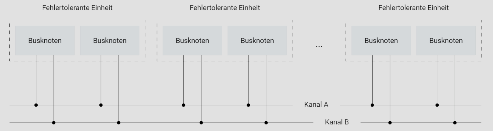

# Einführung

Steigender Funktionsumfang und fortschreitende technologische Entwicklungen haben dazu geführt, dass moderne Automobile heute mit einem umfangreichen Arsenal an elektronischen Funktionen ausgestattet sind. Diese Funktionen reichen weit über die bloße Bedienung des Fahrzeugs hinaus und sind mittlerweile integraler Bestandteil des Fahrerlebnisses.

Neben den allseits bekannten Annehmlichkeiten wie dem Komfortzugang und der Geschwindigkeitsregelung sind es auch die versteckten, jedoch ebenso wichtigen Funktionen, die die Fahrt sicherer und komfortabler machen. Die elektronische Dämpferkontrolle beispielsweise, die unauffällig im Hintergrund arbeitet, reduziert Radlastschwankungen und gewährleistet eine optimale Verbindung zwischen Fahrzeug und Fahrbahn, unabhängig von deren Zustand oder der Beladung des Fahrzeugs. Diese Technologie ermöglicht ein ruhiges und stabiles Fahrverhalten, das den Fahrkomfort erheblich steigert.

Während anfänglich einige elektronische Funktionen, die die Fahrsicherheit verbessern sollten, auf Skepsis stießen, haben sie sich mittlerweile als unverzichtbar erwiesen. Systeme wie das Antiblockiersystem (ABS) und das Elektronische Stabilitätsprogramm (ESP) haben maßgeblich dazu beigetragen, die Unfallzahlen trotz der zunehmenden Anzahl von Fahrzeugen auf den Straßen zu senken. Diese Erfolge haben dazu geführt, dass die Automobilindustrie verstärkt in die Weiterentwicklung und Innovation von aktiven Sicherheits- und Fahrerassistenzsystemen investiert, um das Autofahren noch sicherer zu gestalten.

Neueste Entwicklungen konzentrieren sich auf elektronische Assistenten, die das Fahrerlebnis weiter optimieren sollen. Ein Beispiel hierfür ist ein Assistent, der die Fahrgeschwindigkeit automatisch an den Verkehrsfluss anpasst, um eine reibungslose und sichere Fahrt zu gewährleisten. Ein anderer Assistent überwacht permanent die umliegenden Fahrspuren und warnt den Fahrer vor potenziellen Gefahren beim Überholen oder Spurwechsel, indem er Fahrzeuge in benachbarten Spuren erkennt. Darüber hinaus ermöglicht ein weiterer elektronischer Assistent beispielsweise sicheres Einparken durch präzise Sensoren und automatische Lenkung.

Hinter all diesen fortschrittlichen Sicherheits- und Fahrerassistenzsystemen stehen komplexe Regelungsapplikationen, die nicht mehr isoliert in einem einzelnen Steuergerät arbeiten, sondern über ein ausgeklügeltes Kommunikationssystem mehrere Steuergeräte miteinander verbinden. Diese Entwicklung hin zu verteilten Systemen markiert einen Paradigmenwechsel in der Automobiltechnik, da die Zusammenarbeit verschiedener Komponenten entscheidend für die Effizienz und Wirksamkeit der Systeme ist.

Trotz dieser Vernetzung ist es von entscheidender Bedeutung, dass die zeitlichen Abläufe streng eingehalten werden, um die Sicherheit und Zuverlässigkeit der Systeme zu gewährleisten. Hier kommen Echtzeitkommunikationssysteme mit einem zeitgesteuerten Ansatz zum Einsatz, die eine präzise und zuverlässige Datenübertragung unabhängig von der Last auf dem Kommunikationsbus ermöglichen. Diese Systeme bilden das Rückgrat der modernen Automobiltechnik und tragen maßgeblich dazu bei, dass Fahrzeuge heute sicherer und intelligenter denn je sind.

## Elektronische Assistenten

### Brake-by-Wire

Die Elektronifizierung des Automobils schreitet unaufhaltsam voran und erfasst sogar Domänen, die traditionell von Mechanik und Hydraulik beherrscht werden. Um Fahrerassistenzfunktionen mit noch größerem Nutzen zu realisieren, sind elektronische Schnittstellen zum Fahrwerk, insbesondere zur Bremsanlage und Lenkung, von entscheidender Bedeutung.

Solche elektronischen Schnittstellen umfassen beispielsweise die elektrohydraulische und die elektromechanische Bremse - EMB. Während bei der elektrohydraulischen Bremse die Bremssättel noch hydraulisch betätigt werden, erzeugen bei der elektromechanischen Bremse Elektromotoren direkt an den Rädern die Bremskräfte. Diese werden von einer elektronischen Regeleinheit gesteuert, die ihre Eingaben wiederum über ein elektronisches Bremspedal mit Pedalgefühlsimulator (Force Feedback) erhält. Die Übertragung der Steuer- und Sensorsignale erfolgt über Kommunikationsleitungen.

Durch ein solches Brake-by-Wire-System sind nicht nur individuelle Bremseingriffe an den einzelnen Rädern möglich, was die Bremsstabilität wesentlich verbessert, sondern es ermöglicht auch das Anpassen der Pedalcharakteristik und der Bremswirkung an den Fahrer durch einfache Änderungen der Software. Schließlich erlaubt die Elektronik vor Ort eine verbesserte Diagnosefähigkeit und führt so zu einer erhöhten Betriebssicherheit. Ein weiteres bedeutendes Potenzial eines Brake-by-Wire-Systems liegt in der Integration der Bremse in die Fahrdynamikregelung, um die aktive Sicherheit zu erhöhen.

So vielfältig das Potenzial von Brake-by-Wire-Systemen auch ist, stellen sie gleichzeitig ein großes Sicherheitsrisiko dar. Bereits die Störung oder der Ausfall einer einzelnen Systemkomponente kann schwerwiegende Folgen haben. Daher müssen Brake-by-Wire-Systeme fehlertolerant ausgelegt sein, um sicherzustellen, dass bei Auftreten eines beliebigen Fehlers die gesetzlich vorgeschriebene Grundbremsfunktionalität erhalten bleibt.

### Steer-by-Wire

Die Lenksysteme moderner Kraftfahrzeuge werden je nach benötigten Lenkkräften mit hydraulischen, elektrohydraulischen oder elektrischen Lenkhilfen ausgestattet. Unabhängig von der Art der Lenkunterstützung haben diese Systeme über die Lenksäule eine mechanische Verbindung zwischen Lenkrad und gelenkten Rädern, sodass selbst bei Ausfall der Servounterstützung der mechanische Eingriff erhalten bleibt.

Bei einem elektrischen Lenksystem, wie in der Grafik dargestellt, wird der Lenkeingriff des Fahrers über eine Steuerleitung von einem Steuergerät erfasst, verarbeitet und als Steuerbefehl an den Aktor übertragen, der ihn in eine Bewegung umsetzt. Anstelle der mechanischen Kopplung gibt es einen Aktor zur Radeinstellung (Radwinkelsteller) und einen Motor zur Simulation der Rückstellkräfte am Lenkrad (Handkraftaktor). Die Koordination zwischen Handkraftaktor und Radwinkelsteller erfolgt durch den Lenkungsregler. Die Lenksäule wird sozusagen durch Kommunikationsleitungen ersetzt, wodurch der Fahrer "by wire" lenkt.

Neben der Möglichkeit einer variablen Lenkunterstützung und Lenkübersetzung liegt das größte Potenzial einer solchen Lenkung nach dem Steer-by-Wire-Prinzip in der Integration der Lenkung in die Fahrdynamikregelung zur Erhöhung der aktiven Sicherheit. Als konsequente Weiterentwicklung des heutigen ESP eröffnet ESP II durch aktive Lenkregelfunktionen neue Dimensionen der Fahrdynamik und Fahrstabilität.

Da ein Ausfall der Lenkung den Verlust der Fahrzeugkontrolle bedeutet, zählt die Lenkung bereits zu den sicherheitskritischsten Systemen im Fahrzeug. Durch den Verzicht auf die mechanische Rückfallebene beim Lenksystem wird die Diskussion über die Zuverlässigkeit sicherheitskritischer elektronischer Systeme im Fahrzeug noch intensiver. Auf dem Weg zum Steer-by-Wire-System müssen noch eine Reihe von komplexen Aufgaben gelöst werden, insbesondere in Bezug auf die Fehlertoleranz.

## Sicherheit und Fehlertoleranz

Das Potenzial aktiver Sicherheits- und Fahrerassistenzfunktionen ist enorm, doch gerade elektronische Systeme mit Schnittstellen zum Fahrwerk bergen ein erhebliches Sicherheitsrisiko. Schon der Ausfall einzelner Komponenten kann schwerwiegende Folgen haben. Um die Sicherheit von By-Wire-Systemen zu gewährleisten, wird versucht, Fehler von vornherein durch die Perfektionierung der Systemkomponenten zu vermeiden.

Trotz aller Vorkehrungen kann es dennoch zu Fehlern kommen. In solchen Fällen wird das Konzept der Fehlertoleranz genutzt, um die Funktion des Gesamtsystems aufrechtzuerhalten. Fehlertoleranz erfordert zusätzliche Maßnahmen, um auftretende Fehler zu tolerieren. Dabei wird zwischen Informationsredundanz und struktureller Redundanz unterschieden, die beide eine große Bedeutung für die Sicherstellung einer sicheren Datenkommunikation haben.

Informationsredundanz wird durch die Hinzufügung von zusätzlichen Informationen zur Nutzinformation erzeugt, beispielsweise zur Fehlererkennung und -korrektur. Um sicherzustellen, dass die festgelegten Anwendungsfunktionen auch bei Fehlern in kommunikationsspezifischen Komponenten weiterhin fehlerfrei bleiben, wird das Kommunikationssystem um zusätzliche, für den Betrieb nicht notwendige Komponenten erweitert (strukturelle Redundanz).

Es gibt zwei Arten der Redundanzaktivierung: statische Redundanz, die ständig aktiv ist, und dynamische Redundanz, die nur bei Fehlern aktiviert wird. Aufgrund der hohen Anforderungen an die Echtzeitfähigkeit von verteilten sicherheitskritischen Systemen wird für Kommunikationssysteme in dieser Umgebung nur das Prinzip der statischen Redundanz verwendet.

Um das Sicherheitsrisiko von By-Wire-Systemen zu minimieren, wird auch die redundante Auslegung des Kommunikationskanals betrachtet. Dabei ist es entscheidend, dass auf beiden Kommunikationskanälen stets die gleichen Informationen übertragen werden, damit der Ausfall eines Kanals toleriert werden kann.

Die Wahl einer bestimmten physikalischen Topologie beeinflusst ebenfalls die Fehlertoleranz eines Kommunikationssystems. Zum Beispiel ermöglicht die Verwendung einer aktiven Sterntopologie die Vermeidung der Ausbreitung von Fehlern, indem fehlerhafte Kommunikationszweige vom aktiven Sternkoppler abgeschaltet werden.

## Zusammensetzbarkeit

## Motivation für FlexRay

Determinismus und Fehlertoleranz

**Sicherheitskritische Fahrerassistenzfunktionen** mit elektronischen Schnittstellen zum Fahrwerk stellen höchste Anforderungen an die Zuverlässigkeit, Sicherheit und Echtzeitfähigkeit des Kommunikationssystems. Benötigt wird ein Kommunikationssystem mit der Eigenschaft der [Zusammensetzbarkeit](https://elearning.vector.com/mod/page/view.php?id=228 "Zusammensetzbarkeit"), dessen Kerneigenschaft es ist, eine buslastunabhängige **deterministische und fehlertolerante Datenkommunikation** zu gewährleisten.

CAN

Diesem anspruchsvollen Anforderungsbündel kann  **CAN (Controller Area Network)** , die im Kfz etablierte  **Kommunikationstechnologie** , nicht gerecht werden, da CAN auf einem **ereignisorientierten Kommunikationsansatz** basiert. Das bedeutet, dass jeder Busknoten eines Kommunikationssystems zu jedem Zeitpunkt auf das gemeinsame Kommunikationsmedium zugreifen kann. Der Einsatz von Techniken zur Auflösung von Kollisionen führt dazu, dass sich der Kommunikationsablauf erst zur Laufzeit ergibt. Ereignisgesteuerte Kommunikationssysteme ermöglichen die schnelle Reaktion auf asynchrone Vorgänge, sind jedoch  **nicht deterministisch** .

Weil die zeitliche Schnittstelle in einem ereignisgesteuerten Kommunikationssystem nicht definiert ist, wirkt sich das Hinzufügen und Entfernen von Busknoten auf den Kommunikationsablauf aus. Diese Auswirkungen machen streng genommen eine vollständig neue Validierung des Gesamtsystems erforderlich. Ereignisgesteuerte Kommunikationssysteme weisen **nicht** die Eigenschaft der **[Zusammensetzbarkeit](https://elearning.vector.com/mod/page/view.php?id=228 "Zusammensetzbarkeit")** auf.

Weil die CAN-Kommunikationstechnologie aufgrund fehlenden redundanten Strukturen und Mechanismen auch den hohen Anforderungen an die **Fehlertoleranz** **nicht** gerecht werden kann, zudem im Serieneinsatz lediglich mit einer maximalen Datenrate von 500 KBit/s aufwarten kann, experimentierten schon so manche Kfz-Hersteller in den 90er Jahren mit fehlertoleranten, zeitgesteuerten Kommunikationstechniken, die sehr hohe Datenraten zuließen.

## Anfänge von FlexRay

Allerdings ergaben die Untersuchungen und Erfahrungen bei den Kfz-Herstellern, dass keine der untersuchten Kommunikationstechniken allen Anforderungen für einen Serieneinsatz für zukünftige, sicherheitskritische Systeme in Kraftfahrzeugen gerecht werden könnte. Deshalb verabredeten **BMW und DaimlerChrysler** 1999 die Spezifikation und Entwicklung einer zukünftigen, einheitlichen, zeitgesteuerten und fehlertoleranten Kommunikationstechnik gemeinsam voranzutreiben. Als Ergebnis dieser Zusammenarbeit entstand die erste grobe Anforderungsspezifikation für  **FlexRay** .

## FlexRay Konsortium

Gründung

Ein wesentlicher Grund für den Erfolg von FlexRay war die Gründung des FlexRay Konsortiums, in dessen Rahmen sich im Jahre 2000 die beiden Kfz-Hersteller DaimlerChrysler und BMW sowie die beiden Chiphersteller Motorola und Philips zusammenschlossen.Ziel

Das Ziel des Konsortiums bestand in der Schaffung eines herstellerübergreifenden, deterministischen und fehlertoleranten Kommunikationsstandards, welchen jedes Mitglied des Konsortiums ohne die Zahlung von Lizenzgebühren nutzen kann.Einsatzgebiete

Als **Haupteinsatzgebiete** standen sicherheits- und zeitkritische Anwendungen im Automobil im Vordergrund. Ebenso intendierte man FlexRay aufgrund seiner Datenrate von 10 Mbit/s als Backbone im Automobil zu etablieren.Spezifikation

Nachdem das FlexRay Konsortium im Jahr 2010 die Spezifikation in der Version 3.0.1 veröffentlicht hatte, wurde mit der Überführung in einen ISO-Standard begonnen. Mittlerweile ist die **ISO 17458** verfügbar. Diese beschreibt das FlexRay Protokoll, die physikalische Schicht und Conformance Tests zu deren Überprüfung. Der vollständige Standard ist über die ISO verfügbar.
