# FlexRay Kommunikation

## Kommunikationsarchitektur

Ein FlexRay-Kommunikationssystem (FlexRay Cluster) besteht aus einer Reihe von FlexRay-Knoten und einem physikalischen Übertragungsmedium (FlexRay-Bus), das alle FlexRay-Knoten verbindet. Da FlexRay-Kommunikation nicht an eine bestimmte physikalische Topologie gebunden ist, können verschiedene physische Topologien für einen FlexRay-Cluster verwendet werden. Sowohl Punkt-zu-Punkt-Verbindungen als auch Linientopologien, passive Sterntopologien oder aktive Sterntopologien sind möglich.

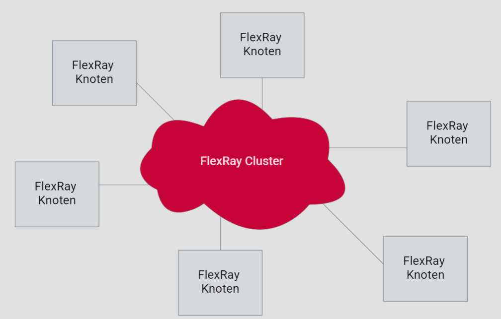

Um das Ausfallrisiko zu minimieren, sieht FlexRay eine redundante Auslegung des Kommunikationskanals vor. Jeder der beiden Kommunikationskanäle kann mit einer Datenrate von bis zu 10 MBit/s betrieben werden. Diese Redundanz kann auch genutzt werden, um die Datenrate auf bis zu 20 MBit/s zu erhöhen. Die Entscheidung zwischen Fehlertoleranz und erhöhter Datenrate kann für jede einzelne FlexRay-Botschaft getroffen werden.

Ein FlexRay-Cluster basiert auf einer zeitgesteuerten Kommunikationsarchitektur, bei der Aktionen im verteilten System statisch und zeitlich festgelegt aktiviert werden. Dieses Zeitsteuerungsprinzip ermöglicht nicht nur eine deterministische Datenkommunikation, sondern auch die einfache Zusammenstellung eines Kommunikationssystems und die Umsetzung von Konzepten wie Fehlertoleranz durch die Kopplung von Redundanzen und das gleichzeitige Aktivieren von Aktionen.

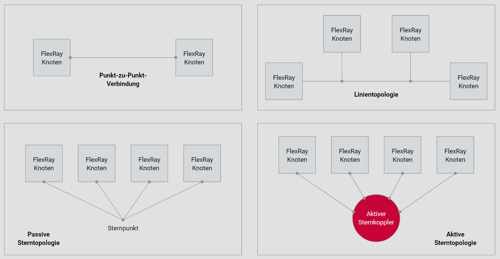

Für die Zeitsteuerung wird das TDMA-Verfahren (Time Division Multiple Access) verwendet, was bedeutet, dass FlexRay-Knoten im Gegensatz zu CAN nicht unkontrolliert auf den Bus zugreifen dürfen. FlexRay-Knoten müssen sich strikt an einen genau definierten Kommunikationsablaufplan halten, der jedem FlexRay-Botschaften pro Kommunikationszyklus einen bestimmten Zeitschlitz zuweist und damit die Sendezeitpunkte aller FlexRay-Botschaften festlegt.

Die Grafik "TDMA-Prinzip" zeigt einen exemplarischen Kommunikationsablaufplan mit Kommunikationsabläufen auf dem Kommunikationsmedium. Diesem Plan liegt ein Kommunikationssystem zugrunde, das aus vier Busknoten besteht, wobei jeder Busknoten zwei Botschaften zu ganz bestimmten Zeitpunkten übertragen muss.

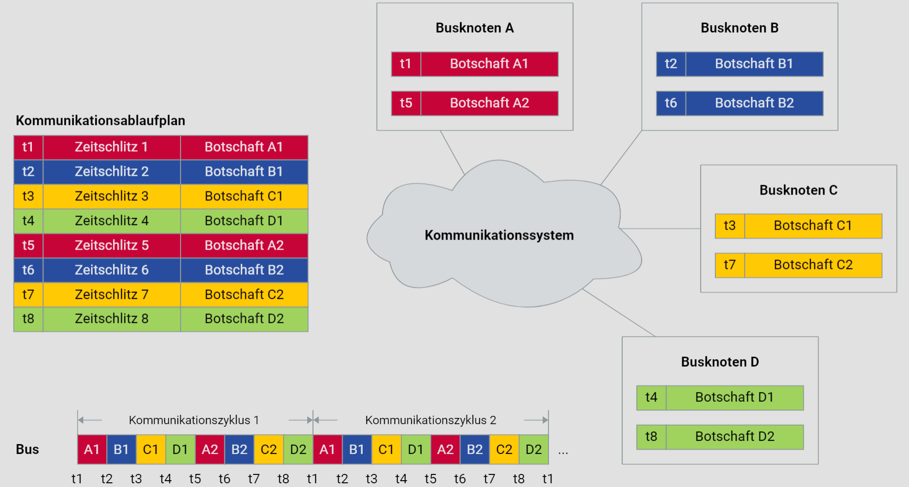

## Passive Topologien

Die FlexRay-Kommunikation ist nicht an eine bestimmte physikalische Topologie gebunden. Sowohl einfache Punkt-zu-Punkt-Verbindungen als auch Linientopologien oder Sterntopologien sind möglich. Zudem kann der Systemdesigner zwischen einer einkanaligen und einer zweikanaligen Kommunikation wählen.

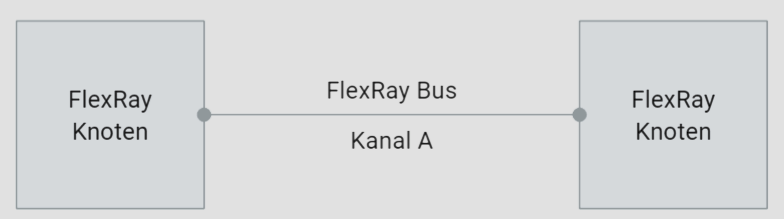

Bei einer Punkt-zu-Punkt-Verbindung werden zwei FlexRay-Knoten direkt miteinander verbunden. Gemäß der Electrical Physical Layer Specification (EPL-Spezifikation) darf die Verbindung nicht länger als 24 Meter sein. Bei drei FlexRay-Knoten werden sie über einen zentralen, aber passiven, Sternpunkt verbunden, was als passive Sterntopologie bezeichnet wird. Auch hier darf die Entfernung zwischen zwei FlexRay-Knoten nicht mehr als 24 Meter betragen, und laut EPL-Spezifikation sollten nicht mehr als 22 Knoten zu einem passiven Stern verbunden werden.

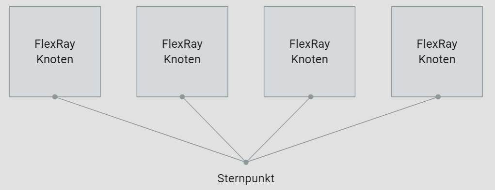

Ab vier FlexRay-Knoten kann der Systemdesigner zwischen passiver Sterntopologie und Linientopologie wählen. Bei der Linientopologie werden die Knoten über separate Stichleitungen (Stubs) an den Bus angeschlossen. Die Grafik "Linientopologie mit redundantem Bus" zeigt einen FlexRay-Cluster mit einer Linientopologie, bei der der Bus redundant ist, was bedeutet, dass Daten über Kanal A und B übertragen werden können.

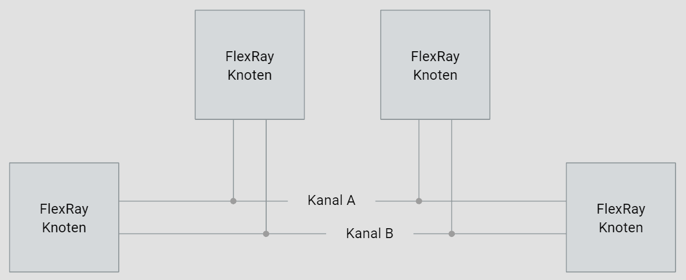

Wenn eine Linientopologie verwendet wird, schreibt die FlexRay-Spezifikation vor, dass die maximale Distanz zwischen zwei Knoten 24 Meter nicht überschreiten darf, wenn die Kommunikationskanäle des Clusters mit 10 MBit/s betrieben werden. Die Reduzierung der Datenrate ermöglicht eine größere Entfernung zwischen den Knoten. Gemäß der Spezifikation sollten nicht mehr als 22 Knoten an eine Linie angeschlossen werden.

Wie bei der passiven Sterntopologie sollten auch für die Linientopologie die Anzahl und Länge der Stichleitungen aus Gründen der Signalintegrität begrenzt werden, um Probleme mit der elektromagnetischen Verträglichkeit zu vermeiden.

## Aktive Topologien

Anstelle einer passiven Sterntopologie können FlexRay-Knoten auch aktiv mithilfe eines aktiven Sternkopplers verbunden werden. Dabei werden die zu einem FlexRay-Cluster zusammenzuschließenden Knoten physikalisch zu einem Stern angeordnet, wobei der passive Sternmittelpunkt durch einen aktiven Sternkoppler ersetzt wird.

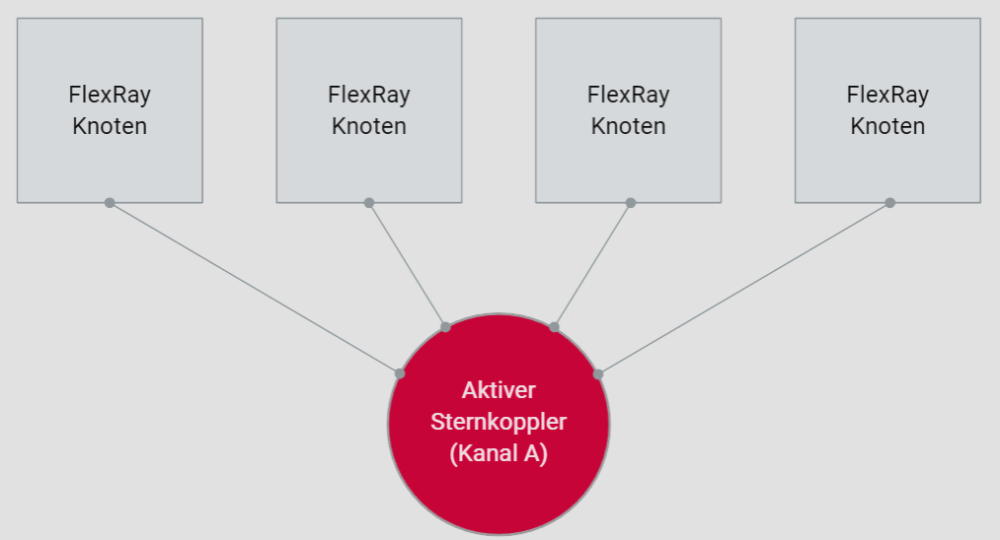

Ein aktiver Sternkoppler nimmt Signale über einen Kommunikationszweig auf, verstärkt sie und leitet sie an alle anderen Kommunikationszweige weiter. An jedem Ende eines Zweiges befindet sich ein FlexRay-Knoten, und der maximale Abstand zwischen dem aktiven Sternkoppler und einem Knoten darf 24 Meter nicht überschreiten.

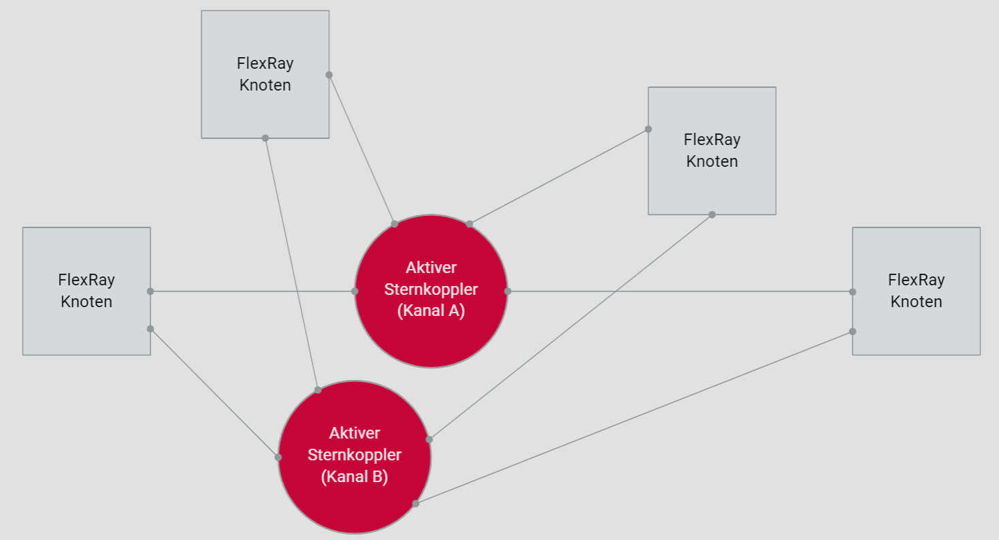

Der Hauptvorteil der aktiven Sterntopologie besteht darin, die Ausbreitung von Fehlern zu verhindern, indem fehlerhafte Kommunikationszweige vom aktiven Sternkoppler abgeschaltet werden können. Darüber hinaus ermöglicht diese Topologie FlexRay-Cluster mit größeren Ausdehnungen und aufgrund idealer Busabschlüsse elektrisch stabilere Verhältnisse.

Die Grafik "Aktive Sterntopologie" zeigt eine aktive Sterntopologie mit einem Kommunikationskanal, während die Grafik "Aktive Sterntopologie mit redundantem Bus" eine aktive Sterntopologie mit einem redundanten Kommunikationskanal darstellt.

Bei der Dimensionierung einer aktiven Clustertopologie muss berücksichtigt werden, dass der aktive Sternkoppler die Signalübertragung verzögert. Aufgrund der sogenannten "Star Truncation" muss jede FlexRay-Botschaft mit einer "Transmission Start Sequence (TSS)" beginnen, da der aktive Sternkoppler Zeit benötigt, um in den aktiven Betriebszustand zu gelangen. Gemäß der FlexRay-Spezifikation dürfen 450 Nanosekunden nicht überschritten werden.

Durch das Hintereinanderschalten zweier aktiver Sternkoppler kann die Ausdehnung eines FlexRay-Clusters um 24 Meter auf maximal 72 Meter erweitert werden. Die Sicherstellung der Signalintegrität begrenzt jedoch die maximal erreichbare Netzwerkausdehnung erheblich, sodass in der Praxis eher von einer Netzwerkausdehnung von bis zu 3x12 Metern ausgegangen werden sollte.

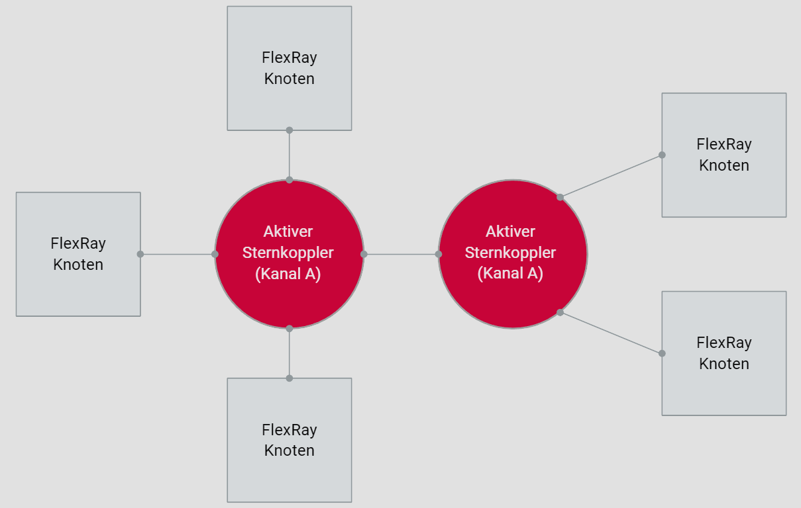

## FlexRay Knoten

Ein FlexRay-Knoten ist ein elektronisches Steuergerät, das über eine FlexRay-Schnittstelle an einen FlexRay-Bus angeschlossen wird. Die Schnittstelle besteht aus einem Kommunikationscontroller und je nach Kanalanzahl einem oder zwei Bustreibern. Der Kommunikationscontroller wird als FlexRay-Controller bezeichnet, während der Bustreiber als FlexRay-Transceiver bezeichnet wird.

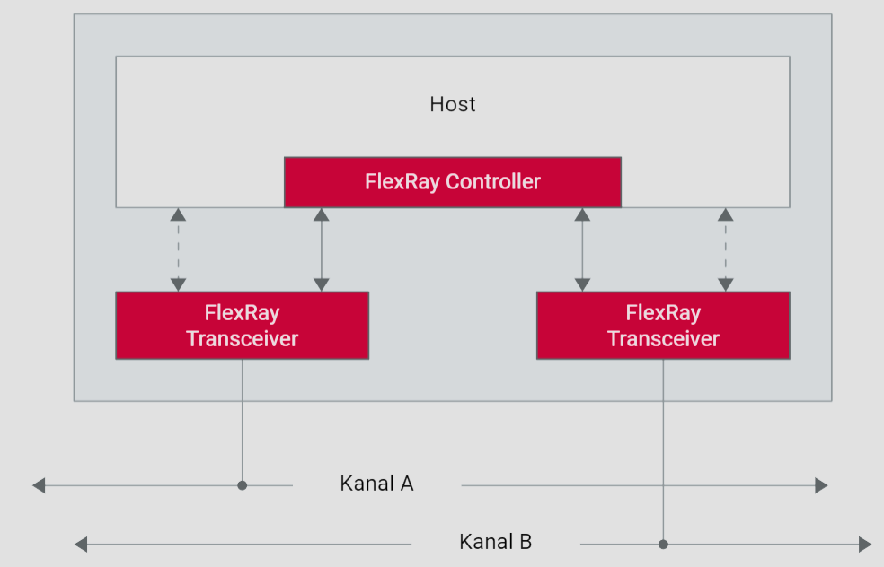

Der FlexRay-Controller verarbeitet das in der FlexRay-Spezifikation definierte Kommunikationsprotokoll. Zu seinen Hauptaufgaben gehören Framing, Buszugriff, Fehlererkennung und -behandlung, Synchronisation, das Schlafenlegen und Aufwecken des FlexRay-Busses sowie das Codieren von Sendebotschaften und das Decodieren von Empfangsbotschaften.

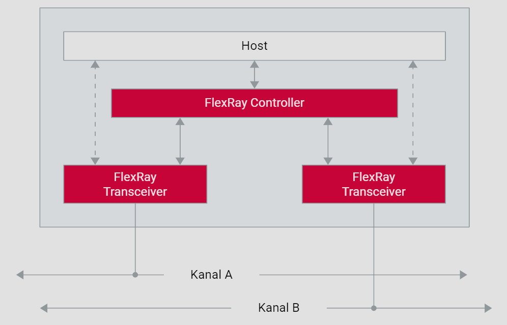

Der FlexRay-Controller kann entweder als Peripheriemodul eines Hosts ausgeführt werden, was als integrierter FlexRay-Controller bezeichnet wird, oder baulich getrennt vom Host sein, was als stand-alone FlexRay-Controller bezeichnet wird. Ein integrierter FlexRay-Controller ermöglicht eine einfachere und schnellere Kommunikation zwischen Host und FlexRay-Controller, während ein stand-alone FlexRay-Controller mehr Flexibilität bietet.

Der FlexRay-Transceiver verbindet den FlexRay-Controller mit dem physikalischen Übertragungsmedium. Seine Hauptaufgabe besteht darin, den vom FlexRay-Controller empfangenen logischen Signalstrom in einen physikalischen Signalstrom umzusetzen und den empfangenden physikalischen Signalstrom in einen logischen Signalstrom umzusetzen.

## FlexRay Controller

Der FlexRay-Controller übernimmt sämtliche Kommunikationsfunktionen, um den Host zu entlasten. Er ist über das sogenannte CHI (Controller Host Interface) mit dem Host verbunden. Im CHI befinden sich frei konfigurierbare Puffer für Sende- und Empfangsbotschaften, wobei die Puffer für Empfangsbotschaften zusätzlich mit Akzeptanzfiltern ausgestattet sind. Auch Status- und Steuerregister sind im CHI untergebracht.

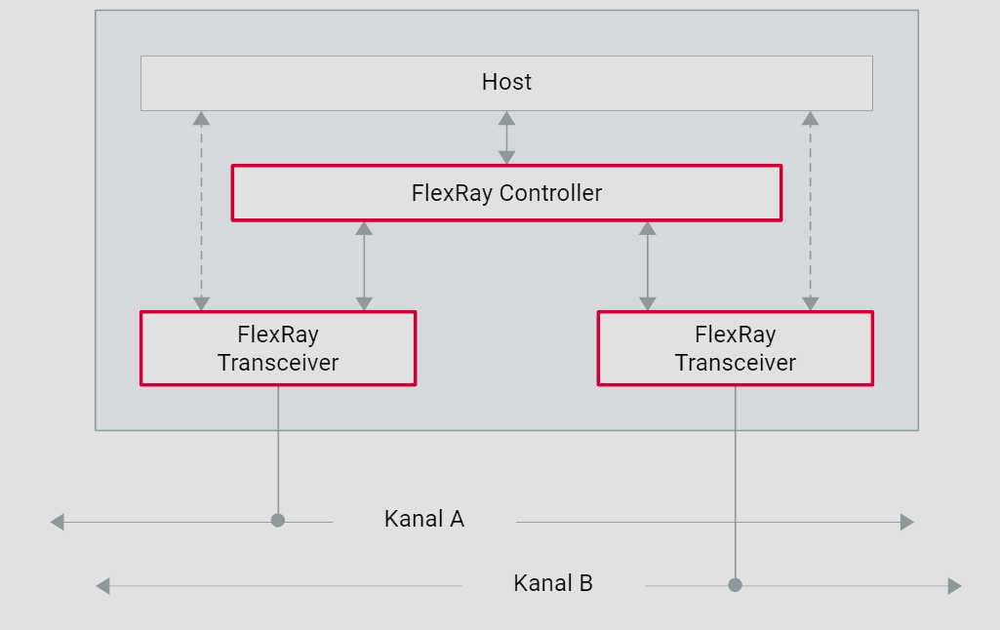

Der Kern des FlexRay-Controllers bildet die Protocol Engine, die aus mehreren Kommunikationskomponenten besteht. Die Media Access Control (MAC) sorgt für den Buszugriff, während die Coding-Komponente die vom MAC erhaltenen Bytes codiert. Die Decoding-Komponente decodiert den logischen Bitstrom, der vom FlexRay-Transceiver empfangen wurde.

Die Frame & Symbol Processing (FSP)-Komponente überprüft die Einhaltung des Kommunikationszyklus des FlexRay-Clusters und überwacht die Empfangsbotschaften auf Übertragungsfehler. Die Clock Synchronization Process-Komponente synchronisiert den FlexRay-Knoten, während sich die Wake Up & Start Up-Komponente um das Aufwecken und Starten kümmert.

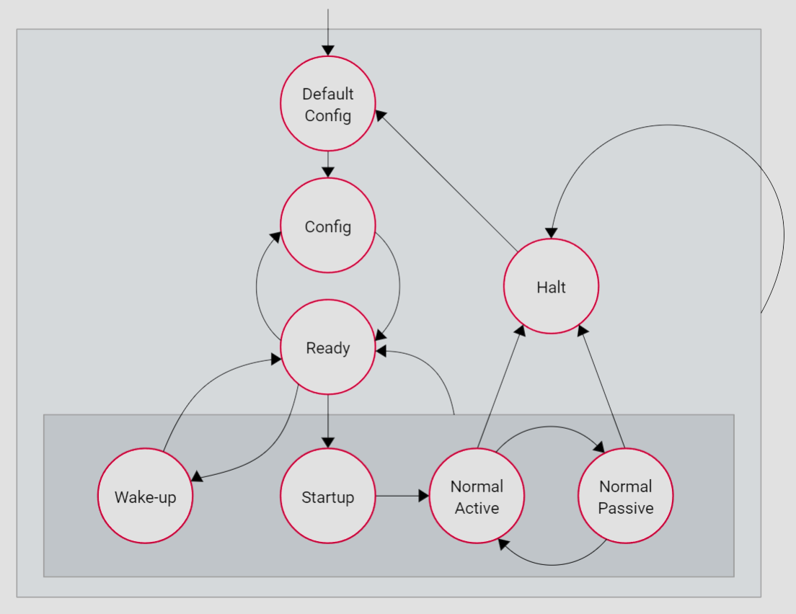

Ein FlexRay-Controller kann je nach Kommunikationsfortschritt acht verschiedene Zustände einnehmen. Jeder Zustand ist durch bestimmte kommunikationsspezifische Tätigkeiten gekennzeichnet, bei denen spezifische Kommunikationskomponenten aktiv sind. Die Protocol Operation Control (POC)-Komponente ist für die Übergänge zwischen den Controllerzuständen verantwortlich.

## FlexRay Bus

Die FlexRay-Technologie unterstützt Datenraten von bis zu 10 MBit/s. Dies und die Vermeidung kostenintensiver geschirmter Leitungen stellen große Herausforderungen für die Sicherstellung der elektromagnetischen Verträglichkeit dar. Das FlexRay Physical Layer definiert daher einige Maßnahmen, um die Immunität gegenüber hochfrequenten Störfeldern und elektrostatischen Entladungen (ESD) zu erhöhen und die Emission von Störungen zu reduzieren.

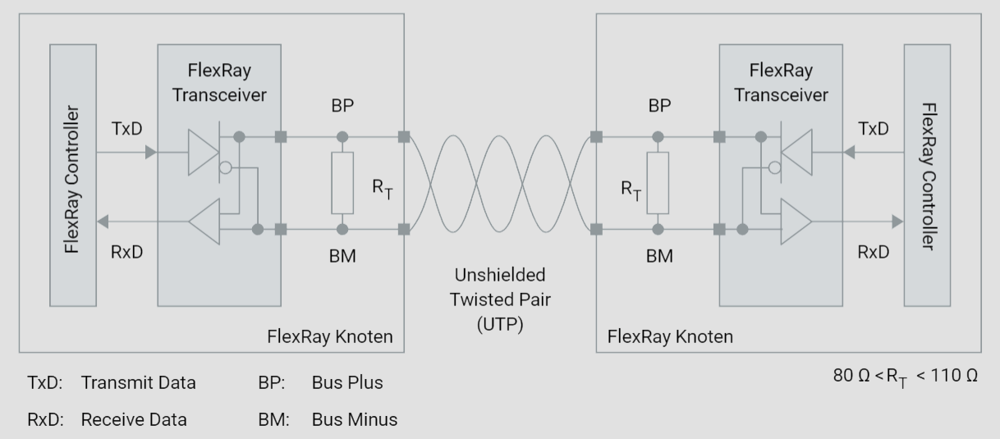

Die physikalische Signalübertragung im FlexRay-Cluster basiert auf der Übertragung von Spannungsdifferenzen, wodurch Störspannungen, die durch Motoren, Zündanlagen und Schaltkontakte induziert werden, unschädlich gemacht werden können. Die Emissionen bleiben aufgrund der vergleichsweise geringen Differenzspannungen (2 Volt für den Buspegel "Data_1", -2 Volt für den Buspegel "Data_0") begrenzt.

Aufgrund der differenziellen Signalübertragung besteht der FlexRay-Bus aus zwei Leitungen: Bus Plus (BP) und Bus Minus (BM). Das Verdrillen der beiden Leitungen reduziert das magnetische Feld erheblich, weshalb üblicherweise verdrillte Leiterpaare verwendet werden, in der Regel ohne Abschirmung aus Kostengründen.

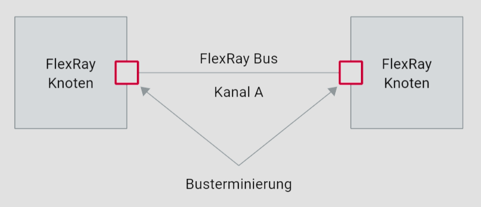

Die Terminierung der Enden des Kommunikationskanals mit Abschlusswiderständen verhindert Reflexionen in einem FlexRay-Cluster aufgrund der endlichen Signalausbreitungsgeschwindigkeit. Die FlexRay-Spezifikation schreibt eine Last zwischen 40 und 55 Ohm vor, was bedeutet, dass die Busabschlusswiderstände zwischen 80 und 110 Ohm liegen müssen.

Anstatt jedem Ende des Kommunikationskanals einen einzelnen Busabschlusswiderstand zuzuweisen, kann der FlexRay-Bus mit einem geteilten Busabschluss terminiert werden. Der geteilte Busabschluss fungiert als Tiefpassfilter, der hochfrequente Signale gegen Masse kurzschließt, ohne die Gleichspannungsverhältnisse zu beeinflussen.

## FlexRay Buspegel

Die physikalische Signalübertragung in einem FlexRay-Cluster basiert auf der Übertragung von Spannungsdifferenzen, auch bekannt als Differenzsignalübertragung. Das Übertragungsmedium, der FlexRay-Bus, besteht daher aus den beiden Leitungen "Bus Plus" (BP) und "Bus Minus" (BM).

Die Electrical Physical Layer Specification definiert vier Buspegel, die entweder dem rezessiven oder dominanten Buszustand zugeordnet sind. Der rezessive Buszustand ist durch eine Differenzspannung von Null Volt gekennzeichnet, während der dominante Buszustand eine Differenzspannung von ungleich Null Volt aufweist.

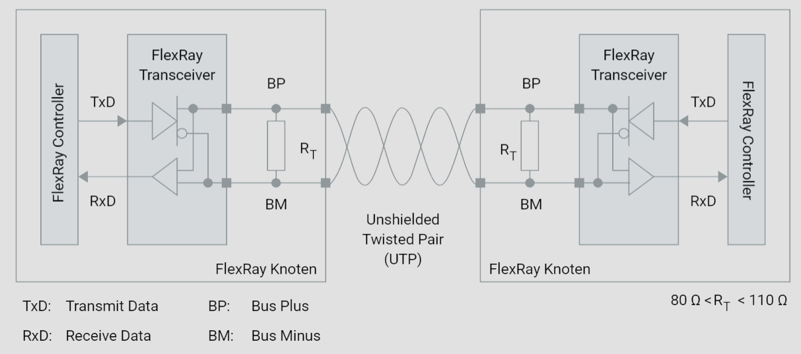

Sowohl der Buspegel "Idle" als auch der Buspegel "Idle Low Power" sind rezessiv. Der Buspegel "Idle" wird dadurch charakterisiert, dass beide Leitungen das Potenzial von 2,5 Volt aufweisen, was zu einer Differenzspannung von 0 Volt führt. Der gültige Bereich für den Idle-Buspegel liegt zwischen 1,8 Volt und 3,2 Volt.

Der Buspegel "Idle Low Power" tritt auf, wenn sich alle FlexRay-Transceiver im Low-Power-Modus befinden. Auch dieser Buspegel ist durch eine Differenzspannung von 0 Volt gekennzeichnet, jedoch weisen beide Leitungen das Potenzial von 0 Volt auf. Der gültige Bereich liegt zwischen -0,2 Volt und 0,2 Volt.

Die beiden Buspegel "Data_1" und "Data_0" sind dominante Buspegel. Beim Buspegel "Data_1" beträgt die Spannungsdifferenz zwischen den Busleitungen 2 Volt, wobei BP ein Potenzial von 3,5 Volt und BM ein Potenzial von 1,5 Volt aufweist. Dies repräsentiert die logische Eins. Beim Buspegel "Data_0" beträgt die Spannungsdifferenz ebenfalls 2 Volt, jedoch weist BP ein Potenzial von 1,5 Volt und BM ein Potenzial von 3,5 Volt auf, was die logische Null repräsentiert. Die Grafik "FlexRay Buspegel" zeigt die verschiedenen Buszustände und -pegel sowie die entsprechenden Spannungsschwellen für Sender und Empfänger.

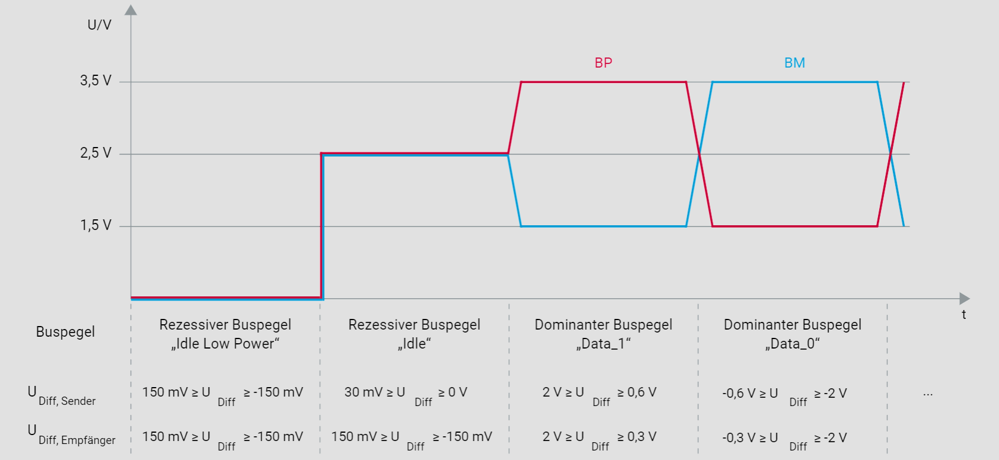

## FlexRay Busankopplung

Es ist nicht möglich, einen FlexRay Controller direkt mit dem physikalischen Übertragungsmedium zu verbinden, da auf diesem eine Differenzsignalübertragung stattfindet, während der FlexRay Controller mit binären Signalen arbeitet. Daher wird eine physikalische Busankopplung benötigt, die hauptsächlich vom FlexRay Transceiver abgedeckt wird.

Der FlexRay Transceiver wandelt den vom FlexRay Controller empfangenen logischen Signalstrom in einen Differenzsignalstrom um und umgekehrt. Er setzt auch den vom FlexRay Bus empfangenen physikalischen Differenzsignalstrom in einen logischen Signalstrom um.

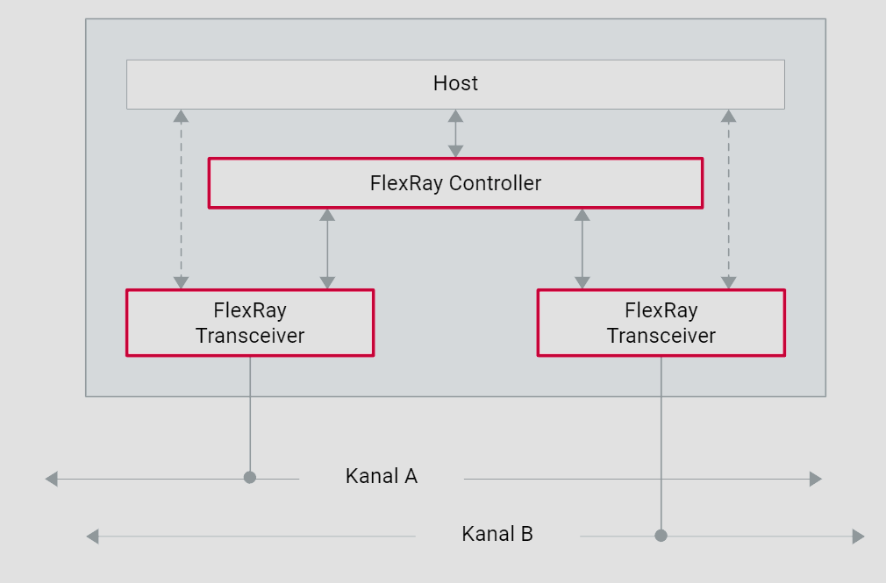

Zusätzlich zur Schnittstelle zum FlexRay Controller verfügt der FlexRay Transceiver über eine Schnittstelle zum Host, die hauptsächlich die Steuerleitungen STBN (Standby) und EN (Enable Input) umfasst. Über diese Leitungen steuert der Host den FlexRay Transceiver, der prinzipiell vier verschiedene Zustände einnehmen kann: "Normal", "Standby", "Sleep" und "ReceiveOnly". Die letzten beiden Zustände sind optional.

Ein wichtiges Merkmal eines FlexRay Transceivers ist seine besonders hohe elektromagnetische Verträglichkeit. Durch den Einsatz von Entstördrosseln können Emissionen weiter reduziert werden, um Störungen anderer Elektroniksysteme weitgehend zu vermeiden.

LC-Entstörschaltungen bei den FlexRay Transceivern unterdrücken eventuelle Störströme durch Schaltungsunsymmetrie mithilfe der relativ hohen Impedanz der Entstördrossel. Zudem werden durch den Tiefpassfilter, der aus einem Kopplungskondensator der Split-Terminierung und einer Entstördrossel besteht, hochfrequente Störungen gegen Masse kurzgeschlossen.

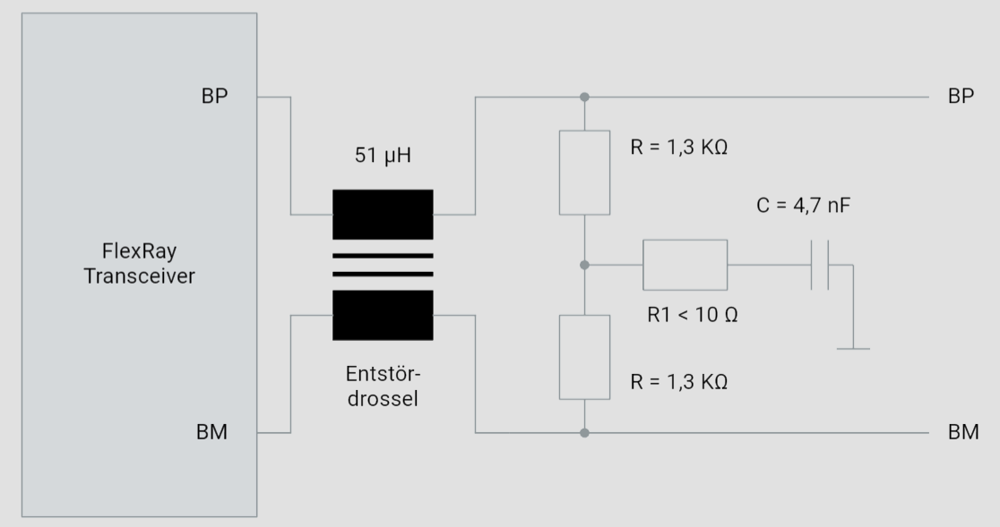

Es ist wichtig, die Streuinduktivität im Auge zu behalten, obwohl Drosseln mit höherer Induktivität bessere Ergebnisse in Bezug auf die Dämpfung liefern können. Die Electrical Physical Layer Specification schreibt bestimmte Werte für Entstördrosseln vor, darunter einen Leitungswiderstand von < 2 Ohm, eine Induktivität von > 50 μH und eine Streuinduktivität von < 1 μH.

Ein kleiner Nachteil der LC-Schaltung besteht darin, dass die Kombination aus Streuinduktivität und Kopplungskondensator einen Schwingkreis bildet, was zu einem Überschwingen der Bussignale führen kann, insbesondere im Zusammenhang mit den Schaltvorgängen des FlexRay Transceivers.

## Busguardian (BG)

Haupteinsatzgebiet von FlexRay sind äußerst sicherheits- und zeitkritische Anwendungen im Automobil. Die Organisation der Kommunikation im FlexRay Cluster in statische Kommunikationszyklen und die Verknüpfung von Zeitschlitzen mit FlexRay Knoten sorgen für einen reibungslosen, deterministischen Kommunikationsablauf. Allerdings können außer Tritt geratene FlexRay Knoten diese Harmonie stören, wenn sie unerlaubt innerhalb nicht für sie vorgesehener Zeitschlitze senden. Die Aufgabe der sog. Busguardians besteht darin, dies zu verhindern.

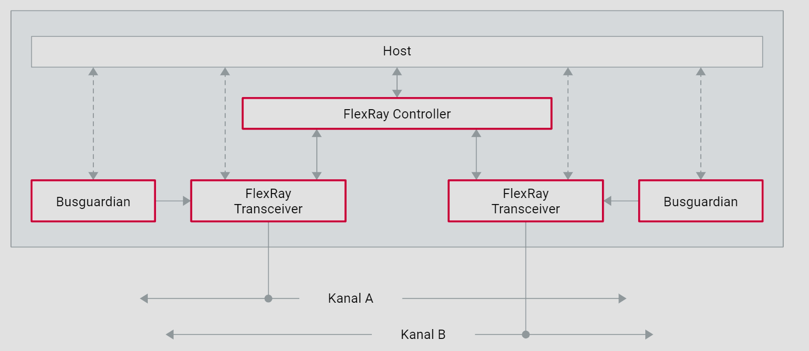

Beim Konzept des lokalen Busguardian ist jedem FlexRay Transceiver ein Busguardian (BG) zugeordnet. Dieser erlaubt es dem FlexRay Transceiver nur dann, die vom FlexRay Controller empfangenen Daten auf den Bus durchzuschalten (wie das realisiert wird, geht aus der Grafik "Lokaler BG" hervor), wenn es laut Kommunikationsplan auch vorgesehen ist.

Im statischen Kommunikationssegment sind die Daten für die reservierten Slots geschützt. Innerhalb des dynamischen Kommunikationssegments kann jedoch kein solcher Schutz gewährleistet werden, da die Botschaften bedarfsabhängig von den FlexRay Knoten gesendet werden. Es besteht lediglich die Möglichkeit, einem FlexRay Knoten das Senden im dynamischen Kommunikationssegment entweder komplett zu erlauben oder komplett zu verbieten.

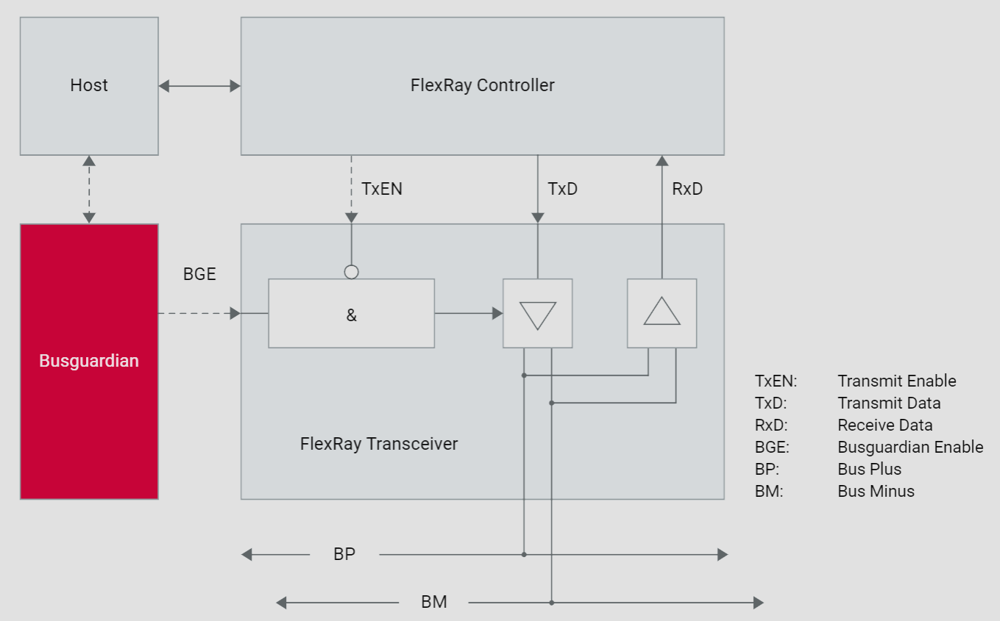

Für die Funktion des Busguardians ist es entscheidend, dass er den Kommunikationsplan und die Zeit im FlexRay Cluster kennt. Idealerweise sollte der Busguardian nicht auf der vom FlexRay Controller erzeugten lokalen Zeitbasis aufsetzen, sondern diese unabhängig vom FlexRay Controller erzeugen können. Dadurch kann ein Busguardian sicherstellen, dass ein FlexRay Knoten nur in seinen Zeitschlitzen senden kann, da er zusätzlich zur Überprüfung der Zeitschlitze auch alle Fehler der Uhr des FlexRay Controllers feststellen kann.

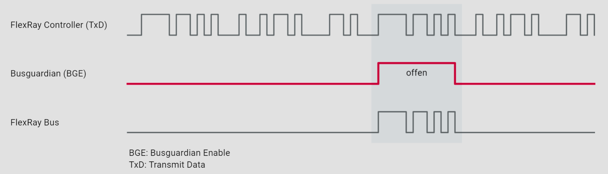

Um diese Funktion umzusetzen, muss der Busguardian fast die gleichen Funktionen wie der FlexRay Controller besitzen. Dies führt zu einer ähnlichen Komplexität wie beim FlexRay Controller und erhöht die Kosten für die FlexRay Kommunikation erheblich. Trotz der Vorteile gibt es bisher keine Implementierungen eines lokalen Busguardians. Die entsprechende Spezifikation Node Local Bus Guardian Specification liegt in der Version 2.0.9 vor, ist aber vorläufig.

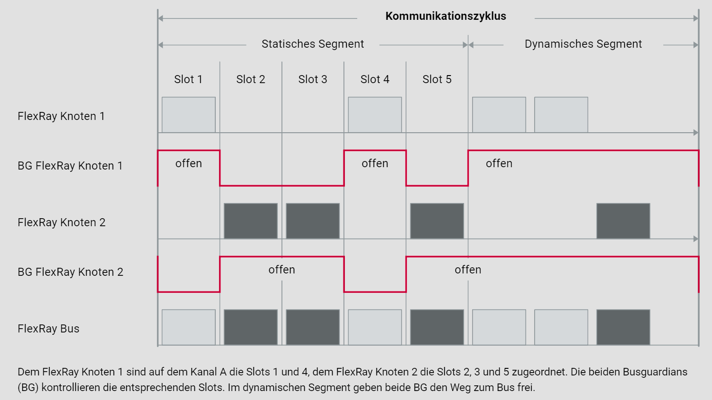

Gleiches gilt für die Central Bus Guardian Specification in der Version 2.0.9. Auch sie ist vorläufig und bisher gibt es keine Implementierungen eines zentralen Busguardians. Bei diesem Konzept befindet sich der Busguardian auf einem aktiven Sternkoppler. Der zentrale Busguardian aktiviert innerhalb des Kommunikationszyklus immer jenen Kommunikationszweig, an dessen Ende der FlexRay Knoten angeschlossen ist, der laut Kommunikationsplan senden darf. So können Signalkollisionen vermieden werden.
