# FlexRay Buszugriff

## Prinzip des Buszugriffs

In einem FlexRay Cluster haben FlexRay Knoten auf zwei unterschiedliche Arten Zugang zum Kommunikationsmedium: zum einen über das TDMA-Verfahren (Time Division Multiple Access) und zum anderen über das FTDMA-Verfahren (Flexible Time Division Multiple Access), dessen Kern das TDMA-Verfahren bildet.

Beim TDMA-Verfahren liegt ein Kommunikationsplan zugrunde, der in eine Anzahl von gleich langen Zeitschlitzen (statische Slots) unterteilt ist, von denen jedem ein FlexRay Knoten zugeordnet ist. Während des Kommunikationsbetriebs erhalten die FlexRay Knoten gemäß dem Zeitplan Zugang zum Kommunikationsmedium (Bus): Vom ersten bis zum letzten statischen Slot haben die den statischen Slots zugeordneten FlexRay Knoten exklusiven Zugang zum Bus, um die ihnen zugeordneten Botschaften zu übertragen.

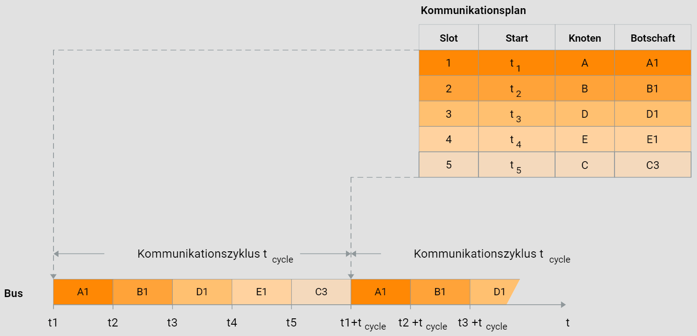

Der Kommunikationsplan wird zyklisch von allen FlexRay Knoten während des Kommunikationsbetriebs abgearbeitet, sodass alle statischen Botschaften mit einer vorgegebenen Periode, also deterministisch, übertragen werden. Somit definiert der Kommunikationsplan den FlexRay Kommunikationszyklus.

Für asynchrone Vorgänge oder die sporadische Übertragung von Botschaften ist das TDMA-Verfahren nicht optimal. Daher bietet die FlexRay Technologie die Möglichkeit, den Zyklus um ein dynamisches Segment zu erweitern, falls Botschaften im FlexRay Cluster nicht nur in einem festen Zeitraster, sondern auch bedarfsorientiert übertragen werden sollen.

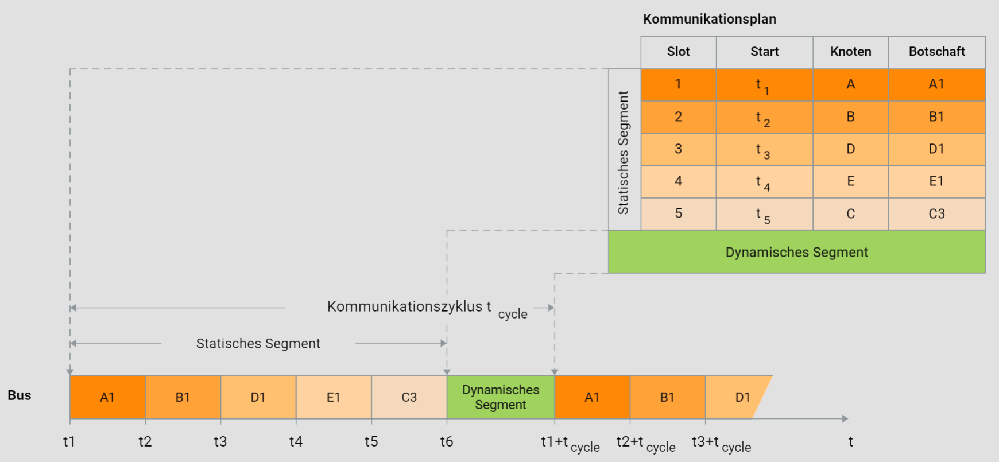

Der Kommunikationszyklus besteht dann aus einem statischen und einem dynamischen Segment. Um trotz der dynamischen Botschaftsübertragung im dynamischen Segment die deterministische Datenkommunikation im statischen Segment sicherzustellen, hat auch das dynamische Segment eine feste zeitliche Länge.

Das FTDMA-Verfahren liegt dem dynamischen Segment zugrunde, das sich vom TDMA-Verfahren dadurch unterscheidet, dass die im Kommunikationsplan definierten dynamischen Botschaften von den entsprechenden FlexRay Knoten bei Bedarf übertragen werden können. Das bedeutet, dass der Zeitpunkt der Botschaftsübertragung nicht vorhersehbar ist. Da das dynamische Segment eine endliche Länge hat, können sendewillige FlexRay Knoten möglicherweise ihre dynamischen Botschaften gar nicht übertragen.

## Kommunikationszyklus

In einem FlexRay Cluster erfolgt die Datenkommunikation zyklisch auf der Grundlage eines Zeitplans. Der Kommunikationszyklus besteht aus mindestens zwei Zeitsegmenten: dem statischen Segment und dem Segment Network Idle Time (NIT). Das statische Segment ermöglicht die deterministische Übertragung von Botschaften, während im NIT-Segment keine Datenkommunikation stattfindet und es zur Synchronisierung der lokalen Uhren dient.

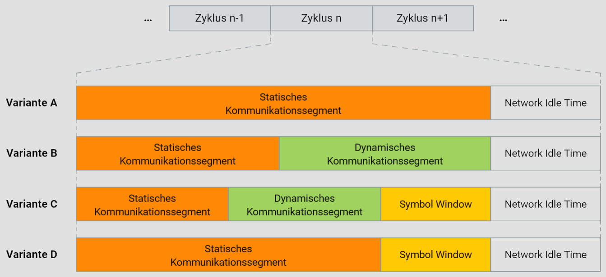

Optional kann der Kommunikationszyklus um das dynamische Zeitsegment und ein Symbol Window erweitert werden. Das dynamische Zeitsegment ermöglicht die bedarfsorientierte Übertragung von Botschaften und folgt bei Bedarf immer dem statischen Segment. Das Symbol Window wird für die Übertragung von Symbolen verwendet, wobei das Collision Avoidance Symbol den Beginn des ersten Kommunikationszyklus anzeigt, das Media Test Symbol für den Test eines Busguardians genutzt wird und das WakeUp Symbol zum Wecken des FlexRay Clusters dient.

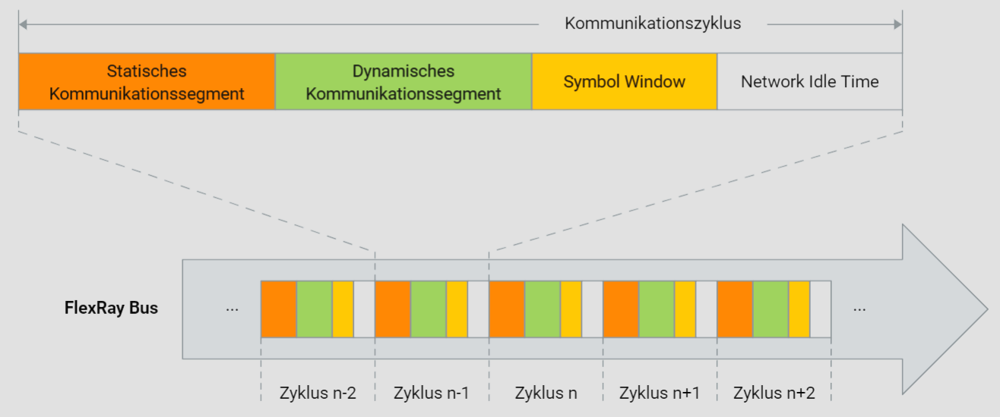

Da nur das statische Segment und das NIT-Segment für einen Zyklus obligatorisch sind, können vier Zyklusvarianten unterschieden werden. In der Grafik "Kommunikationszyklus" ist ein Zyklus dargestellt, der alle Zeitsegmente umfasst: statisches Segment, dynamisches Segment, Symbol Window und NIT.

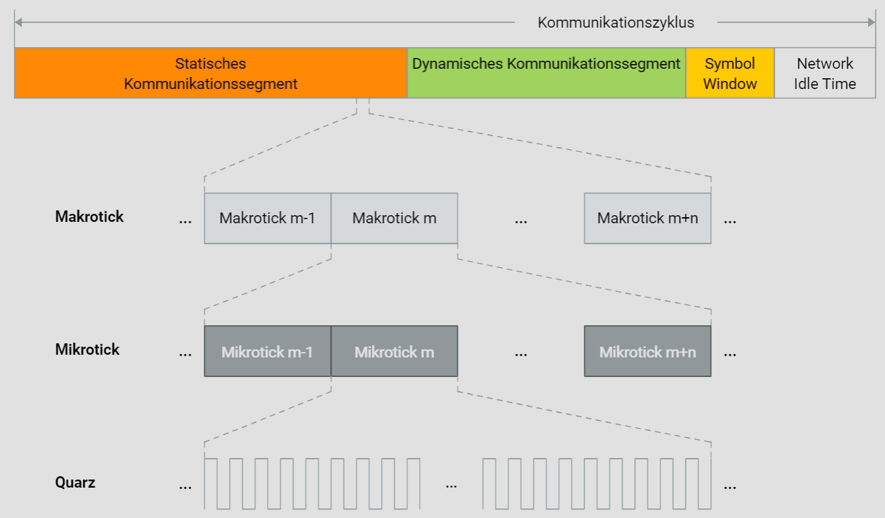

Ein Kommunikationszyklus besteht aus einer festgelegten Anzahl von Makroticks, die den einzelnen Segmenten zugeordnet sind. Die Makroticks werden aus einer bestimmten Anzahl von Mikroticks gebildet, die die kleinste Zeiteinheit lokaler Uhren darstellen. Aufgrund unterschiedlicher Quarzfrequenzen können sich die Makroticks verschiedener FlexRay Knoten aus unterschiedlich vielen Mikroticks zusammensetzen.

## Statisches Segment

Das statische Segment spielt eine entscheidende Rolle im FlexRay-Kommunikationszyklus, da es die äquidistante Datenübertragung sicherstellt, die für verteilte Regelungen so wichtig ist. Dies wird durch das TDMA-Verfahren gewährleistet, das dem statischen Segment zugrunde liegt.

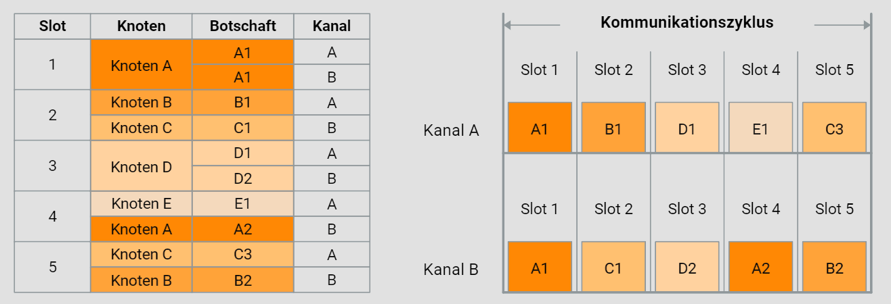

Das TDMA-Verfahren gliedert das statische Segment in eine Anzahl gleich langer Zeitschlitze (statische Slots). Den einzelnen statischen Slots sind FlexRay-Knoten zugeordnet, die während des zyklischen Kommunikationsbetriebs die entsprechenden statischen Botschaften übertragen können. Dies setzt synchronisierte lokale Zähler voraus, die zu Beginn jedes statischen Slots inkrementiert werden und jeweils einem FlexRay-Knoten und einer statischen Botschaft entsprechen.

In der Grafik "Statisches Segment" ist ein Kommunikationsplan für zwei Kanäle (Kanal A und Kanal B) dargestellt. Im ersten Slot wird dieselbe Botschaft übertragen, was bedeutet, dass ein Kanalausfall nicht dazu führt, dass die Botschaft nicht übertragen wird. In den folgenden Slots des statischen Segments werden jedoch auf beiden Kanälen unterschiedliche Botschaften übertragen. Hier kann der redundante Kommunikationskanal entweder zur Erhöhung der Fehlertoleranz oder zur Steigerung der Datenrate genutzt werden. Diese Wahl kann für jede einzelne FlexRay-Botschaft getroffen werden.

Es können maximal bis zu 1023 statische Slots definiert werden. Da mindestens zwei FlexRay-Knoten erforderlich sind, um die globale Zeitbasis zu generieren, muss das statische Segment mindestens zwei statische Slots umfassen.

## Statischer Slot

Eine reibungslose und deterministische Botschaftsübertragung während des statischen Segments erfordert, dass der statische Slot ausreichend lang ist. Die Länge des statischen Slots wird primär durch die längste FlexRay-Botschaft bestimmt. Eine FlexRay-Botschaft besteht grundlegend aus einem Header, Payload, Trailer und Steuerzeichen. Zudem muss der sogenannte Channel Idle Delimiter berücksichtigt werden, der das Ende einer FlexRay-Botschaft kennzeichnet.

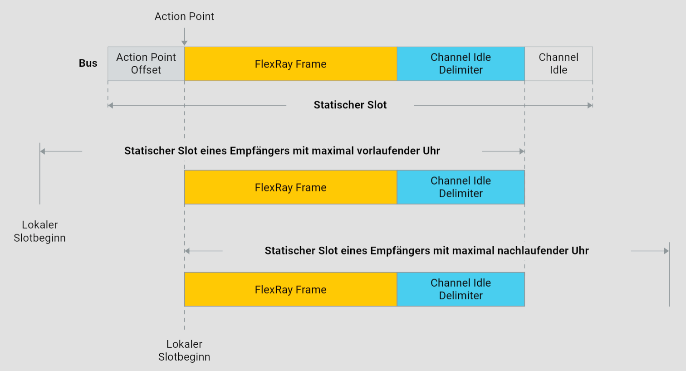

Die Länge des statischen Slots wird auch von der maximalen Signalverzögerung beeinflusst, die höchstens 2,5 Mikrosekunden betragen darf, sowie von der größtmöglichen Zeitabweichung zwischen beliebigen FlexRay-Knoten trotz Synchronisation (Präzision).

Ein statischer Slot ist in vier Zeitsegmente unterteilt. Dies gewährleistet, dass eine Botschaft innerhalb des Slots empfangen werden kann, selbst unter Berücksichtigung maximaler Signalverzögerung und einer möglichen Zeitabweichung zwischen den Knoten.

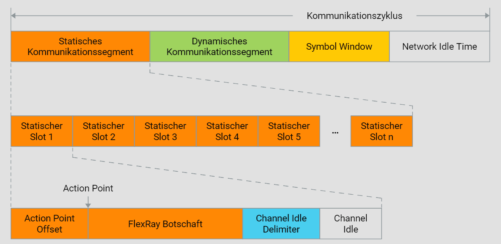

Jeder statische Slot beginnt mit einem Offset, dem sogenannten Action Point Offset, gefolgt vom Action Point und der Botschaftsübertragung. Nach der Botschaftsübertragung und dem Channel Idle Delimiter folgt eine Pause (Channel Idle), deren Dauer dem Action Point Offset entspricht.

Es ist offensichtlich, dass die Präzision und die Signalverzögerung eine umgekehrt proportionale Beziehung zur maximal erreichbaren Datenrate im FlexRay-Cluster haben: Bei schlechteren lokalen Taktgebern oder zunehmender Signalverzögerung muss die Zeitspanne zwischen Slotbeginn und Action Point vergrößert werden, was schließlich die maximale Datenrate reduziert.

## Dynamisches Segment

Das dynamische Segment ist eine optionale Komponente im FlexRay-Protokoll und dient der Übertragung bedarfsorientierter Botschaften, um asynchrone Vorgänge zu unterstützen. Um die deterministische Datenübertragung im statischen Segment nicht zu beeinträchtigen, hat das dynamische Segment stets die gleiche Länge und folgt im Bedarfsfall immer auf das statische Segment.

Das dynamische Segment basiert auf dem FTDMA-Verfahren (Flexible Time Division Multiple Access), das im Wesentlichen auf dem TDMA-Verfahren aufbaut, jedoch einen flexibleren Kommunikationsablauf ermöglicht. Auch im dynamischen Segment gibt es einen Kommunikationsplan, der jedoch nur die Übertragung der dynamischen Botschaften dann vorsieht, wenn es einen entsprechenden Bedarf gibt.

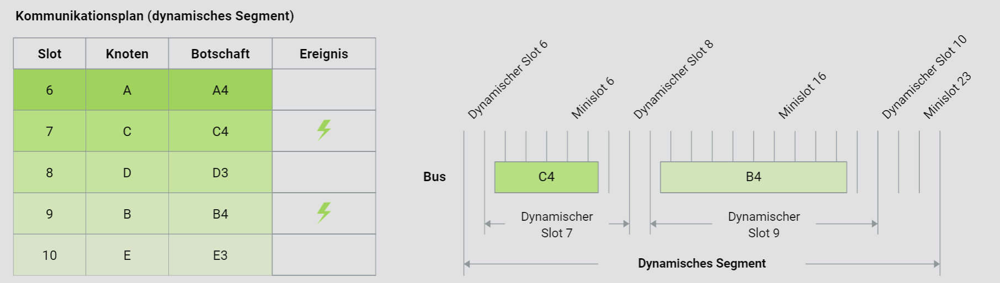

Die Funktionsweise des dynamischen Segments beginnt damit, dass alle FlexRay-Knoten ihre lokalen Zähler inkrementieren. Jeder Zählerwert entspricht einer dynamischen Botschaft und einem FlexRay-Knoten. Wenn für eine dynamische Botschaft kein Sendebefehl vorliegt, inkrementieren die Knoten ihre Zähler um die Länge eines Minislots, was einem Minislot entspricht.

Liegt jedoch ein Sendebefehl vor, wird die entsprechende dynamische Botschaft übertragen. Danach folgt wieder ein Minislot, und die Zähler werden inkrementiert. Dieser Vorgang wiederholt sich, bis entweder das dynamische Segment für die Übertragung nicht mehr ausreicht oder alle dynamischen Botschaften übertragen wurden.

Es besteht ein Zusammenhang zwischen dem Zählerwert und der Übertragungswahrscheinlichkeit: Je höher der Zählerwert, desto unwahrscheinlicher ist die Botschaftsübertragung. Die Botschaft, die dem ersten Minislot oder dem niedrigsten Zählerwert zugeordnet ist, hat die höchste Priorität.

Der Systemdesigner muss sicherstellen, dass auch Botschaften mit niedriger Priorität übertragen werden können, sofern kein anderer Bedarf mit höherer Priorität besteht. Zudem muss gewährleistet sein, dass die Übertragung der längsten dynamischen Botschaft möglich ist.

## Dynamischer Slot

Für die Gestaltung eines dynamischen Slots gelten im Wesentlichen dieselben Prinzipien wie für die statischen Slots. Daher ähnelt der Aufbau eines dynamischen Slots dem eines statischen Slots. Jeder dynamische Slot beginnt mit dem sogenannten Action Point Offset, der am Action Point endet – dem Zeitpunkt, zu dem die Übertragung einer dynamischen Botschaft beginnt. Der Action Point entspricht dabei dem Action Point des Minislots.

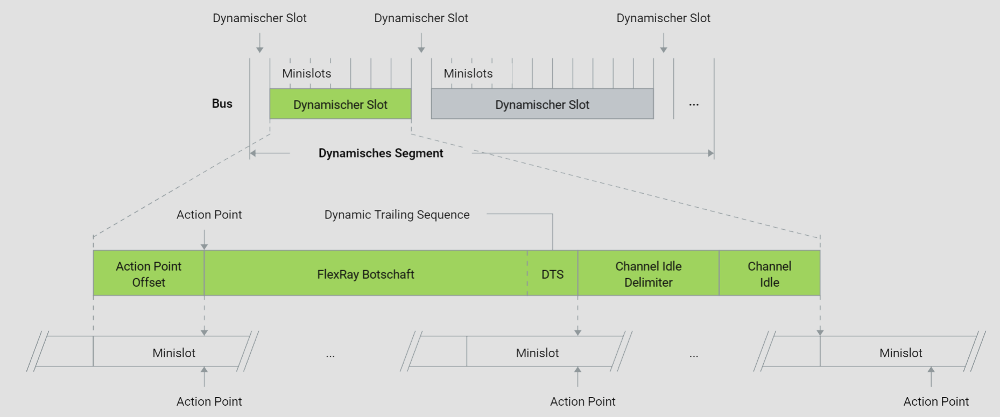

Nach dem Action Point Offset folgen der Action Point selbst und die Botschaftsübertragung. Im dynamischen Segment dürfen Botschaften mit unterschiedlich großen Payloads übertragen werden. Die Botschaftsübertragung wird durch den Channel Idle Delimiter abgeschlossen, der wie im statischen Slot aus elf rezessiven Bits besteht.

Es ist zu beachten, dass gemäß der FlexRay-Spezifikation eine dynamische Botschaft genau mit dem nächsten möglichen Action Point enden muss. Um dies zu gewährleisten, wird die Botschaftsübertragung um die sogenannte Dynamic Trailing Sequence verlängert. Theoretisch kann diese Sequenz maximal einen Minislot lang sein.

## Demonstration

Um das hybride Buszugriffsverfahren und die entsprechende Datenübertragung zu veranschaulichen, betrachten wir ein FlexRay Cluster mit fünf FlexRay Knoten (A bis E). Diese Knoten sind physisch über eine Linie verbunden, wie in der Grafik "Demo-Cluster" dargestellt. Um das Ausfallrisiko zu minimieren, ist der Kommunikationskanal redundant ausgelegt, sodass zwei Kanäle zur Verfügung stehen: Kanal A und Kanal B.

Der Kommunikationsplan, der der Datenübertragung zugrunde liegt, ist in ein statisches und ein dynamisches Segment unterteilt. Beide Segmente bestehen aus fünf Slots, wobei im statischen Segment die statischen Botschaften und im dynamischen Segment die dynamischen Botschaften definiert sind.

Während des Kommunikationsbetriebs werden alle im statischen Segment festgelegten statischen Botschaften gemäß dem Kommunikationsplan übertragen. Die im dynamischen Segment festgelegten dynamischen Botschaften werden jedoch nur dann übertragen, wenn ein Bedarf dafür besteht.

Um Ihnen einen Einblick in die Datenkommunikation im FlexRay Cluster zu geben, stehen Ihnen sowohl eine interaktive Grafik als auch eine Animation zur Verfügung. Die interaktive Grafik zeigt die Kommunikationstechnik im dynamischen Segment, während die Animation Ihnen die Kommunikation sowohl im statischen als auch im dynamischen Segment näher bringt. Bitte lesen Sie die entsprechenden Anleitungen, um die volle Funktionalität der Medienobjekte nutzen zu können.

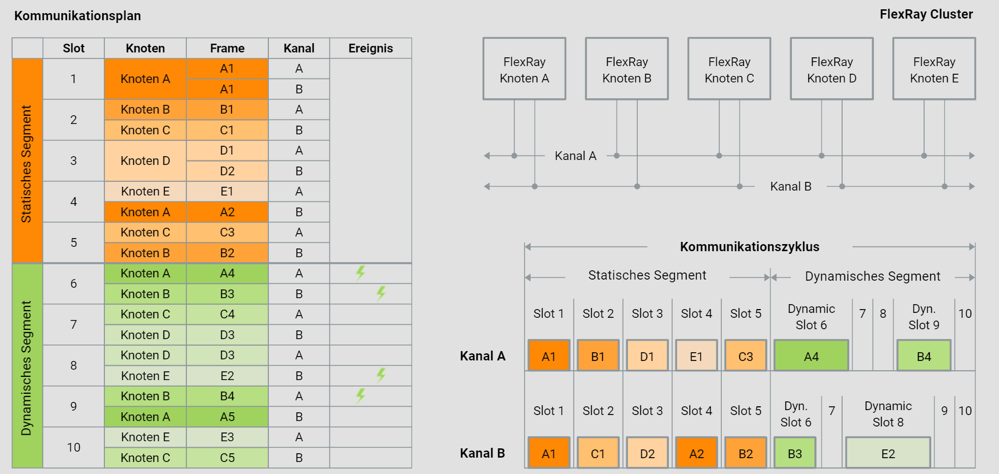

1. Der Kommunikationsbetrieb startet mit der Übertragung der mit dem ersten statischen Slot korrespondierenden Botschaft mit dem ID=0x01. Diese wird vom FlexRay Knoten A gesendet und vom FlexRay Knoten B empfangen.

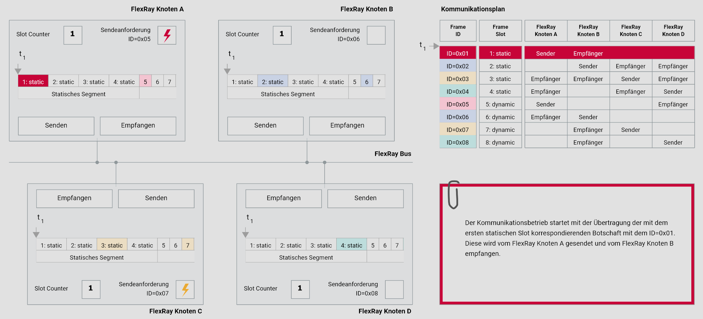

2. Die Statische Botschaft mit dem ID=0x01 ist übertragen. Der erste statische Slot ist beendet. Es folgt die Übertragung der mit dem zweiten statischen Slot korrespondierenden Botschaft mit dem ID=0x02. Diese wird vom FlexRay Knoten B gesendet und von den FlexRay Knoten C und D empfangen.

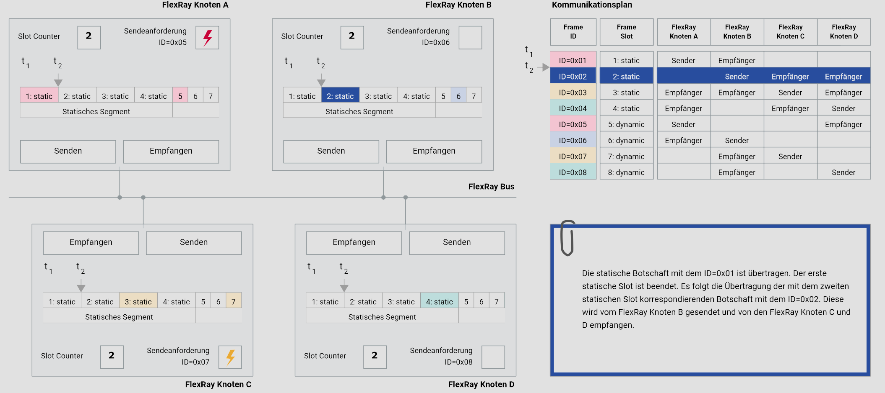

3. Die Statische Botschaft mit dem ID=0x02 ist übertragen. Der zweite statische Slot ist beendet. Es folgt die Übertragung der mit dem dritten statischen Slot korrespondierenden Botschaft mit dem ID=0x03. Diese wird vom FlexRay Knoten C gesendet und von den FlexRay Knoten A und B empfangen.

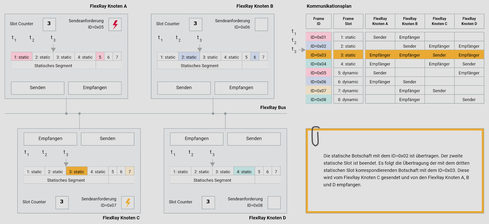

4. Die Statische Botschaft mit dem ID=0x02 ist übertragen. Der zweite statische Slot ist beendet. Es folgt die Übertragung der mit dem dritten statischen Slot korrespondierenden Botschaft mit dem ID=0x03. Diese wird vom FlexRay Knoten C gesendet und von den FlexRay Knoten A und B empfangen.

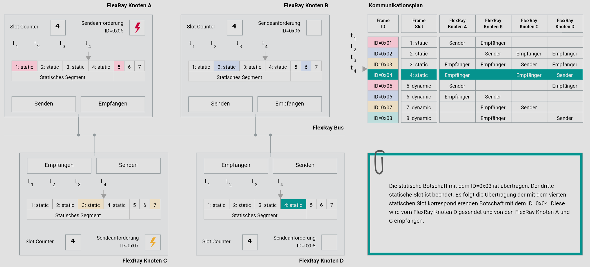

5. Die Statische Botschaft mit dem ID=0x02 ist übertragen. Der zweite statische Slot ist beendet. Es folgt die Übertragung der mit dem dritten statischen Slot korrespondierenden Botschaft mit dem ID=0x03. Diese wird vom FlexRay Knoten C gesendet und von den FlexRay Knoten A und B empfangen.

6. Die Statische Botschaft mit dem ID=0x02 ist übertragen. Der zweite statische Slot ist beendet. Es folgt die Übertragung der mit dem dritten statischen Slot korrespondierenden Botschaft mit dem ID=0x03. Diese wird vom FlexRay Knoten C gesendet und von den FlexRay Knoten A und B empfangen.

7. Die Statische Botschaft mit dem ID=0x02 ist übertragen. Der zweite statische Slot ist beendet. Es folgt die Übertragung der mit dem dritten statischen Slot korrespondierenden Botschaft mit dem ID=0x03. Diese wird vom FlexRay Knoten C gesendet und von den FlexRay Knoten A und B empfangen.

8. Die Statische Botschaft mit dem ID=0x02 ist übertragen. Der zweite statische Slot ist beendet. Es folgt die Übertragung der mit dem dritten statischen Slot korrespondierenden Botschaft mit dem ID=0x03. Diese wird vom FlexRay Knoten C gesendet und von den FlexRay Knoten A und B empfangen.

