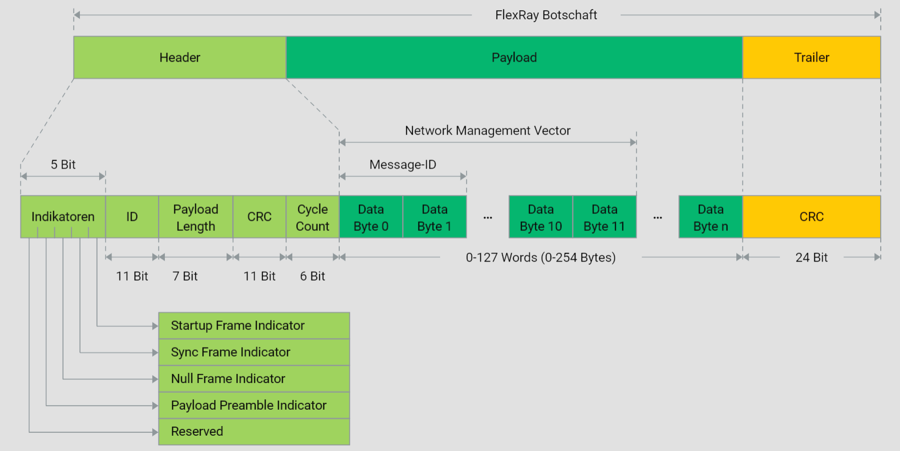
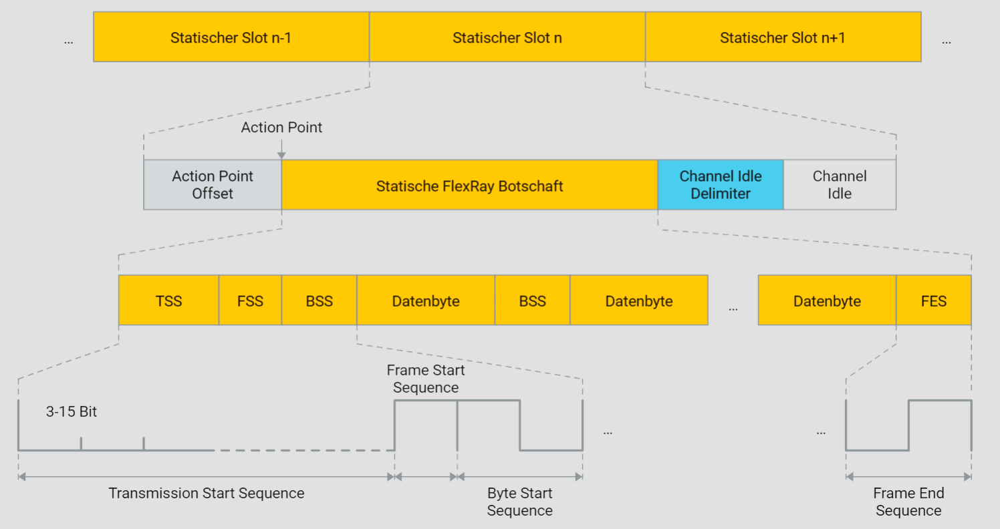
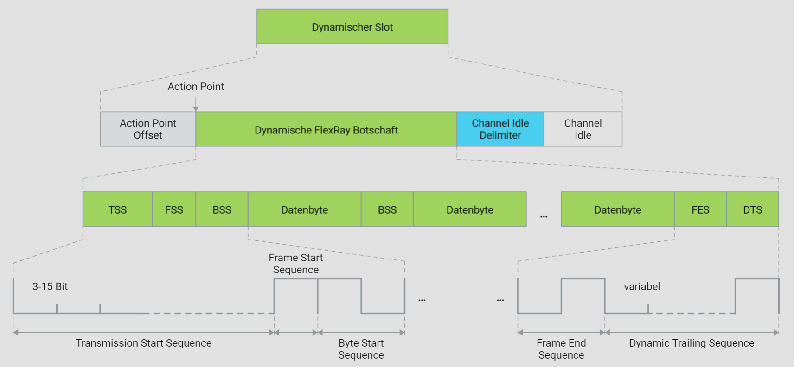

# FlexRay Framing

## Frame Header

In einem FlexRay Cluster erfolgt die Datenübertragung mithilfe eines einheitlichen Botschaftsrahmens, der als FlexRay Botschaft bezeichnet wird. Eine FlexRay Botschaft besteht aus drei Hauptteilen: dem Header, dem Payload und dem Trailer. Der Header besteht aus insgesamt 40 Bits, wovon elf Bits dem Identifier (ID) zugeordnet sind. Diese ID dient zur Identifizierung einer bestimmten Botschaft und entspricht einem Slot. Alle IDs können frei verwendet werden, mit Ausnahme von ID=0x00, die für ungültige Botschaften reserviert ist.

Vor der ID befinden sich vier Indikatorbits, gefolgt von einem reservierten Bit. Diese Indikatorbits dienen zur weiteren Spezifizierung der Botschaft. Der Payload Preamble Indicator zeigt an, ob im Payload einer statischen Botschaft ein Network Management Vector oder im Payload einer dynamischen Botschaft ein Message Identifier übertragen wird.

In speziellen Fällen kann der Sender den Payload einer Botschaft ausschließlich mit Nullen übertragen. In diesem Fall handelt es sich nicht um einen regulären Payload, was durch den Null Frame Indicator angezeigt wird. Der Sync Frame Indicator gibt an, ob die Botschaft, die im statischen Segment übertragen wird, als Sync Frame für die Synchronisation verwendet wird. Der Startup Frame Indicator gibt an, ob die Botschaft, die im statischen Segment übertragen wird, als Startup Frame für den Startvorgang verwendet wird.

Nach dem Identifier folgt die Payload Length, die die Größe des Payloads in Words angibt und aus 7 Bits besteht. Eine FlexRay Botschaft kann insgesamt bis zu 254 Nutzbytes übertragen. Der Identifier wird durch ein CRC-Verfahren gesichert. Hierbei wird basierend auf dem Identifier, der Payload Length, dem Sync Frame Indicator und dem Startup Frame Indicator sowie einem Generatorpolynom, das in der FlexRay Spezifikation definiert ist, eine elf Bit lange Header CRC Sequence berechnet, die dem Payload Length folgt.

Der Header wird durch den Cycle Counter abgeschlossen, der aus sechs Bits besteht und die Nummer des Zyklus repräsentiert, in dem die Botschaft gesendet wird. Der Cycle Counter zählt immer bis 63.

## Frame Payload

Eine FlexRay Botschaft kann maximal 254 Nutzbytes (Payload) transportieren. Die Payload Length, ein Parameter im Header, gibt die Größe des Payloads in Words an. Im statischen Segment haben alle übertragenen Botschaften denselben Payload Length Wert, der vom Systemdesigner während der Konfigurationsphase festgelegt wird. Für dynamische Botschaften kann die Payload Length jedoch unterschiedliche Werte annehmen.

Im statischen Segment besteht die Möglichkeit, die ersten zwölf Nutzbytes für die Übertragung des Network Management Vector zu verwenden, wenn der Payload Preamble Indicator im Header gesetzt ist. Der Network Management Vector dient der Realisierung des Netzmanagements in einem FlexRay Cluster.

Das Setzen des Payload Preamble Indicators bei einer dynamischen FlexRay Botschaft bedeutet nicht, dass der Payload mit einem Network Management Vector beginnt. Stattdessen zeigt es an, dass die ersten beiden Nutzbytes den Message Identifier enthalten. Der Message Identifier ermöglicht es dem Systemdesigner, den Payload genauer zu spezifizieren und als Basis für eine differenziertere Akzeptanzfilterung zu verwenden.

In bestimmten Fällen kann der Sender den Payload einer Botschaft ausschließlich mit Nullen übertragen. Dies geschieht, wenn ein FlexRay Controller gemäß dem Kommunikationsplan eine statische Botschaft übertragen muss, aber der entsprechende Puffer vom Host gesperrt ist. In diesem Fall überträgt der FlexRay Controller die statische Botschaft automatisch als Nullframe, wobei der Null Frame Indicator im Header den Wert "Null" aufweist.

Das CRC-Verfahren (Cyclic Redundancy Check) wird verwendet, um den Payload zu sichern. Dabei wird auf Basis des Headers und des Payloads und unter Verwendung eines in der FlexRay Spezifikation definierten Generatorpolynoms eine CRC-Sequenz berechnet, die dem Header und dem Payload als Trailer angehängt wird. Die Checksumme, die dem Vielfachen des Headers und des Payloads entspricht, ermöglicht dem Empfänger mit hoher Sicherheit die Erkennung von Übertragungsfehlern. Ein Fehler wird erkannt, wenn die Division durch das Generatorpolynom einen Rest ergibt. Das CRC-Verfahren gewährleistet eine hohe Fehlererkennungsfähigkeit, wobei die Hamming-Distanz von der Payload-Größe abhängt.

## Codierung

Die physikalische Übertragung einer Botschaft beginnt nicht mit dem ersten Bit des Frame Headers, sondern mit der Transmission Start Sequence (TSS). Dies geschieht, um sicherzustellen, dass in einem FlexRay Cluster mit aktiver Sterntopologie die ersten Bits einer Botschaft vom aktiven Sternkoppler ordnungsgemäß vom Empfangs- zum Sendezweig transportiert werden können.

Die TSS muss mindestens der Zeit entsprechen, die der aktive Sternkoppler benötigt, um in den aktiven Betriebszustand zu gelangen (Star Truncation), was mindestens 3 und maximal 15 Bits Low Pegel entspricht.

Die TSS wird mit der Frame Start Sequence (FSS) abgeschlossen, gefolgt vom Übertrag des Frame Headers. Jedes zu übertragende Byte wird von einer Byte Start Sequence (BSS) eingeleitet, die dem Empfänger zur Nachsynchronisation dient. Das Ende einer Botschaft wird durch die Frame End Sequence (FES) markiert.

In sowohl statischen als auch dynamischen Slots signalisieren elf rezessive Bits (Channel Idle Delimiter), dass das Kommunikationsmedium wieder frei ist. Um sicherzustellen, dass eine dynamische Botschaft genau mit dem nächstmöglichen Action Point endet, wird die Botschaftsübertragung um die Dynamic Trailing Sequence verlängert. Diese Sequenz ermöglicht es jedem Empfänger, den Minislot zu bestimmen, in dem die dynamische Botschaft endet.

Zur Veranschaulichung der Codierung von Botschaften stehen zwei Grafiken zur Verfügung. Die Grafik "Statische Botschaft" zeigt eine statische Botschaft unter Berücksichtigung der für die physikalische Übertragung erforderlichen Codeelemente. Die Grafik "Dynamische Botschaft" zeigt eine dynamische Botschaft ebenfalls unter Berücksichtigung dieser Codeelemente.

