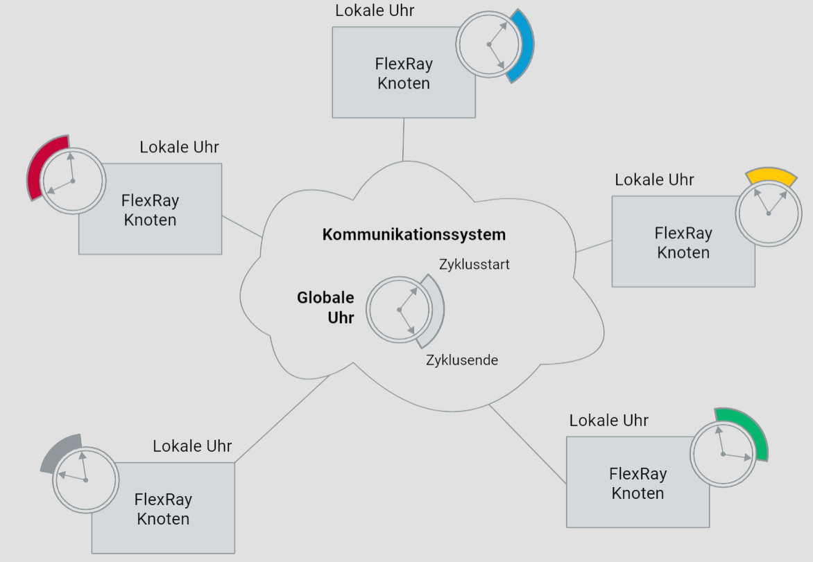
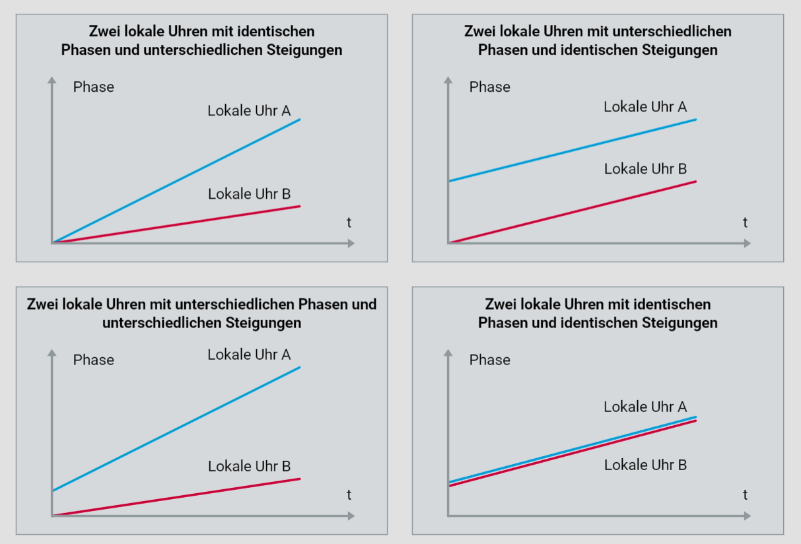
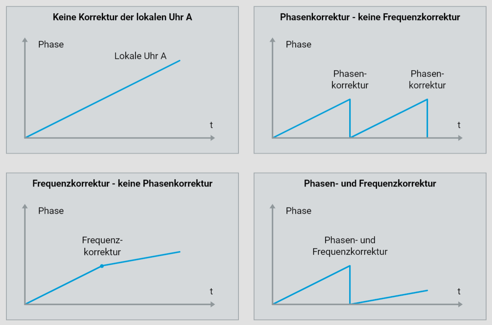
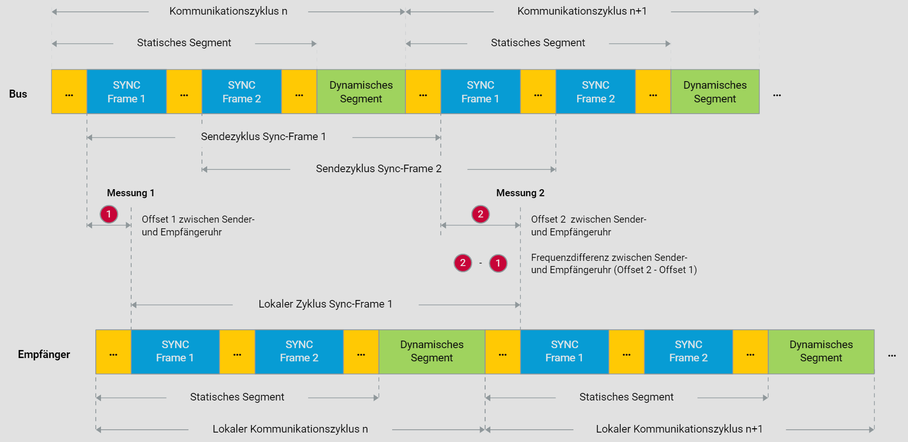
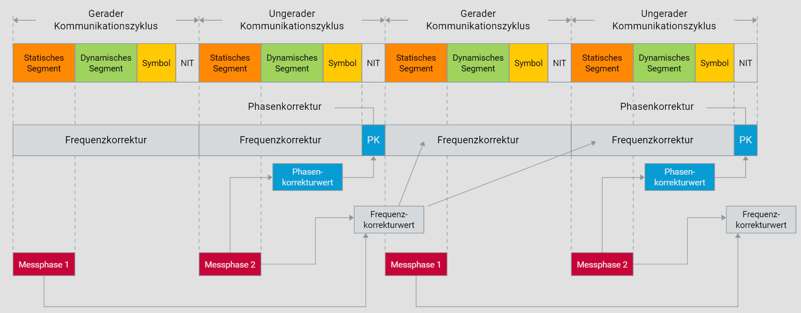

# FlexRay Synchronisation

## Synchronisationsprinzip

Der reibungslose Ablauf der Datenkommunikation in einem FlexRay Cluster erfordert, dass alle FlexRay Knoten das gleiche Zeitverständnis haben. Dies ist wichtig, da alle Aktivitäten des Kommunikationssystems durch das Erreichen bestimmter Zeitpunkte ausgelöst werden.

In einem FlexRay Cluster müssen alle Kommunikationszyklen aus der Sicht aller FlexRay Knoten immer zum gleichen Zeitpunkt beginnen und gleich lang sein. Außerdem müssen alle statischen Slots der FlexRay Knoten immer an derselben Stelle innerhalb des Zyklus beginnen.

Ein globales Zeitverständnis ist daher unerlässlich. Da ein FlexRay Cluster auf einer Multi-Master-Architektur basiert, kann ein solches globales Zeitverständnis nur kooperativ auf der Grundlage der lokalen Zeitbasen erreicht werden. Dies ist eine Herausforderung, da Frequenztoleranzen und Toleranzen der passiven Bauelemente in der Quarzbeschaltung zu unterschiedlichen Frequenzen und Phasen führen, selbst bei identischer Nennfrequenz.

Laut FlexRay-Spezifikation sollten die lokalen Taktgeber über die gesamte Lebensdauer eines Fahrzeugs eine maximale Frequenzabweichung von 1500 ppm nicht überschreiten. Diese Abweichung berücksichtigt verschiedene Faktoren, darunter Quarztoleranzen von etwa 250 ppm über zehn Jahre, die Beitrag der passiven Bauelemente zur Frequenzabweichung und ein Sicherheitsfaktor.

Ohne regelmäßige Synchronisierung der lokalen Zeitbasen kann keine netzwerkweite Zeitbasis hergestellt werden. Die FlexRay Knoten verwenden spezielle Algorithmen, um ihre lokalen Uhren so zu korrigieren, dass alle lokalen Uhren im FlexRay Cluster bis auf eine definierte Abweichung zu einer globalen Uhr synchron laufen. Dazu kommen Phasen- bzw. Offsetkorrektur- und Frequenz- bzw. Steigungskorrekturverfahren zum Einsatz.

## Phasen- und Frequenzkorrektur

Die Phasenkorrektur gewährleistet, dass die lokalen Uhren der FlexRay Knoten dieselbe Phase haben und somit die Kommunikationszyklen immer zeitgleich beginnen. Ohne weitere Korrekturmaßnahmen müsste bei der Systemauslegung stets die maximale Abweichung der lokalen Takte berücksichtigt werden.

Angenommen, die maximale Abweichung zweier lokaler Uhren beträgt 3000 ppm und die Zyklusdauer beträgt beispielsweise 10 Millisekunden, würde sich am Ende des Zyklus ein Drift von 30 Mikrosekunden ergeben, was die maximale Datenrate erheblich beeinträchtigen würde.

Eine Verbesserung der Bandbreiteneffizienz zeitgesteuerter Kommunikationssysteme wird durch den zusätzlichen Einsatz der Frequenzkorrektur erreicht. Während die Phasenkorrektur lediglich die Symptome der Frequenzabweichung behandelt, setzt die Frequenzkorrektur an der Ursache für die Frequenzabweichung an.

Die Frequenz eines Quarzes kann jedoch nicht direkt beeinflusst werden. Daher wird ein Frequenzteiler eingesetzt, um die Quarzfrequenz in die lokale Zeitbasis des FlexRay Knotens umzusetzen. Durch die Änderung des Teilverhältnisses können die lokalen Uhren beschleunigt oder verlangsamt werden, um sicherzustellen, dass die Kommunikationszyklen für alle FlexRay Knoten gleich lang sind.

Durch die Frequenzkorrektur laufen alle lokalen Uhren nahezu mit derselben Geschwindigkeit, wodurch trotz transienter Störungen die Abweichungen der lokalen Uhren innerhalb definierbarer Grenzen bleiben, die für die Synchronisation erforderlichen Synchronisationsbotschaften über mehrere Kommunikationszyklen hinweg. Der Einsatz der Frequenzkorrektur macht die Uhrensynchronisation in einem FlexRay Cluster äußerst robust gegenüber transienten Störungen und ermöglicht die Toleranz des Ausfalls der Uhrensynchronisation über mehrere Kommunikationszyklen hinweg.

## Synchronisationsmethode

Die Synchronisation der lokalen Uhren in einem FlexRay Cluster beruht darauf, dass jedem FlexRay Knoten die Sende- und Empfangszeitpunkte aller statischen Botschaften von Anfang an bekannt sind. Dadurch können alle Knoten des Clusters den Offset und die Steigung so korrigieren, dass nach nur wenigen Zyklen alle FlexRay Knoten jeden Kommunikationszyklus zum selben Zeitpunkt mit dem gleichen Takt beginnen.

In einem FlexRay Cluster fungieren mindestens 2 und maximal 15 FlexRay Knoten als Sync-Knoten oder Sync Node, die pro Zyklus eine Sync-Botschaft in einem definierten statischen Slot übertragen. Diese Sync-Botschaften sind keine zusätzlichen Nachrichten, sondern normale statische Botschaften, bei denen der Sync Frame Indicator gesetzt ist.

Alle FlexRay Knoten vergleichen die vorher bekannten Zeitpunkte mit den tatsächlichen Zeitpunkten, zu denen die Sync-Botschaften eintreffen. Anhand dieser Vergleiche erstellen sie eine sortierte Liste von Differenzen, aus der sie mit dem Fault Tolerant Midpoint (FTM) Algorithmus ihren Offsetkorrekturwert berechnen.

Der FTM-Algorithmus eliminiert die Extremwerte aus der Liste, um zu verhindern, dass stark abweichende lokale Uhren die Kommunikation im FlexRay Cluster stören. Bei bis zu sieben Sync-Knoten werden Minimum und Maximum gestrichen. Bei mehr als sieben Sync-Knoten fallen auch die zweitgrößten und zweitkleinsten Messwerte heraus.

Die verbleibenden Messwerte werden addiert und gemittelt, und das Ergebnis stellt den Offsetkorrekturwert dar. Die Ermittlung des Steigungskorrekturwerts erfolgt auf ähnliche Weise, wobei die FlexRay Knoten die Zykluslängen messen, die den Sync-Botschaften zugrunde liegen.

Sowohl die Offset- als auch die Steigungskorrektur basieren auf den lokalen Uhren, wobei die kleinste Einheit der Mikrotick ist. Ein FlexRay Knoten gleicht seinen Offset aus, indem er am Ende jedes ungeraden Zyklus eine entsprechende Anzahl von Mikroticks in der NIT hinzufügt oder weglässt. Dadurch verschiebt er den Start seines nächsten Zyklus und passt sich den anderen FlexRay Knoten an.

Damit die Steigungskorrektur nicht wie eine Offsetkorrektur wirkt, verteilt ein FlexRay Knoten die Anzahl von Mikroticks, die dem Steigungskorrekturwert entspricht, gleichmäßig über den folgenden geraden und ungeraden Zyklus. So kann jeder FlexRay Knoten seinen Zyklus entweder verkürzen oder verlängern.
